<h1 id="2-requirements-development-and-software-solution-design">Capítulo II: Requirements Development and Software Solution Design</h1>

<h2 id="21-competidores">2.1 Competidores</h2>

<h3 id="211-analisis-competitivo">2.1.1 Análisis competitivo</h3>

<table border="1">
<thead>
<tr>
<th colspan="7" style="text-align: center;"><b>Competitive Analysis Landscape</b></th>
</tr>
</thead>
<tbody>
<tr>
<td colspan="2" align="center">¿Por qué llevar a cabo este análisis?</td>
<td colspan="5" align="center">El objetivo es definir el posicionamiento de IdeaForge frente a plataformas y comunidades que facilitan conexiones entre fundadores, colaboradores y proyectos en etapa temprana, identificando cómo nuestra propuesta se diferencia al enfocarse específicamente en la formación de equipos alrededor de ideas, y no en la contratación de servicios o la búsqueda de empleo.</td>
</tr>
<tr>
<th></th>
<th></th>
<th><b>IdeaForge</b></th>
<th><b>YC Co-Founder Matching</b></th>
<th><b>CoFoundersLab</b></th>
<th><b>Indie Hackers</b></th>
</tr>
<tr>
<td><strong>Perfil</strong></td>
<td>Overview</td>
<td>Plataforma digital orientada a que emprendedores, estudiantes y creativos publiquen ideas de proyectos y encuentren personas interesadas en unirse según rol, habilidades o intereses. Su propuesta central es facilitar la formación de equipos en etapas tempranas.</td>
<td>Servicio vinculado al ecosistema de Y Combinator orientado a conectar personas que buscan cofundadores para startups. Se apoya en la marca YC y en su enfoque hacia compañías de alto crecimiento.</td>
<td>Red enfocada en conectar emprendedores, cofundadores, asesores e inversionistas. Ofrece una comunidad global con herramientas para buscar perfiles compatibles y ampliar la red de contactos.</td>
<td>Comunidad digital de emprendedores y builders donde los usuarios comparten aprendizajes, productos e ideas para iniciar y hacer crecer negocios online. La colaboración surge más por comunidad que por matching estructurado.</td>
</tr>
<tr>
<td></td>
<td><strong>Ventaja competitiva – ¿Qué valor ofrece al cliente?</strong></td>
<td>Permite conectar ideas con personas dispuestas a construirlas desde etapas tempranas, con un enfoque más accesible y colaborativo para usuarios que aún no tienen una startup consolidada.</td>
<td>Alta credibilidad de marca y fuerte asociación con el ecosistema startup; resulta atractivo para personas que buscan cofundadores con ambición de construir startups escalables.</td>
<td>Gran alcance de red y variedad de perfiles, incluyendo fundadores, advisors e inversionistas, lo que amplía las posibilidades de conexión y networking.</td>
<td>Comunidad activa alrededor de side projects, negocios digitales y aprendizaje entre pares, útil para quienes desean construir en público o descubrir oportunidades de colaboración de manera orgánica.</td>
</tr>
<tr>
<td><strong>Perfil de marketing</strong></td>
<td><strong>Mercado objetivo</strong></td>
<td>Personas con ideas de proyectos que buscan formar equipo y personas con habilidades que desean unirse a iniciativas tempranas, especialmente en entornos académicos, emprendedores y creativos.</td>
<td>Fundadores y futuros fundadores que buscan un cofounder para una startup con potencial de crecimiento, normalmente dentro de un entorno más orientado a venture-backed startups.</td>
<td>Emprendedores, cofundadores, asesores e inversionistas interesados en networking y en la formación de equipos o conexiones estratégicas.</td>
<td>Emprendedores independientes, builders, makers y personas interesadas en lanzar productos o negocios digitales, muchas veces de manera autodidacta y pública.</td>
</tr>
<tr>
<td></td>
<td><strong>Estrategias de marketing</strong></td>
<td>Enfoque en colaboración temprana, claridad de propuesta de valor y construcción de comunidad en universidades, redes sociales y ecosistemas de innovación.</td>
<td>Apalancamiento de la reputación de Y Combinator, contenidos educativos para founders y cercanía con el mundo de startups de alto crecimiento.</td>
<td>Promoción de comunidad global, acceso a expertos y herramientas premium para encontrar cofounders y advisors.</td>
<td>Contenido generado por la comunidad, exposición pública de proyectos, historias de fundadores y aprendizaje compartido entre usuarios.</td>
</tr>
<tr>
<td><strong>Perfil de producto</strong></td>
<td><strong>Productos & servicios</strong></td>
<td>Publicación de ideas, exploración de proyectos, perfiles de usuario con habilidades e intereses, conexión entre creadores de ideas y posibles colaboradores, y funcionalidades futuras para fortalecer el matching y la colaboración.</td>
<td>Matching entre posibles cofundadores dentro del ecosistema YC y acceso a recursos de contenido y comunidad relacionados con startups.</td>
<td>Búsqueda de cofounders, contacto con advisors, networking con otros emprendedores y acceso a opciones premium de interacción.</td>
<td>Comunidad de discusión, visibilidad de proyectos y productos, intercambio de experiencias entre emprendedores y exposición de avances de construcción.</td>
</tr>
<tr>
<td></td>
<td><strong>Precios & costos</strong></td>
<td>Modelo previsto con acceso base accesible y posibilidad de incorporar funcionalidades premium o visibilidad adicional en etapas posteriores.</td>
<td>El valor percibido está altamente ligado al ecosistema YC y su reputación; su principal barrera no es el precio, sino el tipo de perfil y ambición esperada dentro del entorno.</td>
<td>Cuenta con una oferta gratuita limitada y opciones premium para ampliar funcionalidades como búsqueda, mensajería y networking.</td>
<td>Su propuesta gira más alrededor de comunidad y contenidos; la participación inicial resulta accesible, pero no ofrece un sistema de matching estructurado como eje principal.</td>
</tr>
<tr>
<td><strong>Análisis SWOT</strong></td>
<td><strong>Fortalezas</strong></td>
<td>Enfoque claro en conectar ideas con personas para formar equipos desde cero; propuesta más inclusiva para etapas tempranas; cercanía con contextos estudiantiles, creativos y emprendedores.</td>
<td>Marca extremadamente fuerte dentro del ecosistema startup y orientación específica a la búsqueda de cofounders.</td>
<td>Red amplia y madura, con variedad de perfiles y cobertura internacional.</td>
<td>Comunidad reconocida entre builders digitales y fuerte componente de aprendizaje entre pares.</td>
</tr>
<tr>
<td></td>
<td><strong>Debilidades</strong></td>
<td>Startup en etapa inicial que todavía debe validar masa crítica, propuesta de valor y confianza entre usuarios.</td>
<td>Puede percibirse como un espacio más orientado a startups tradicionales de alto crecimiento que a proyectos verdes, académicos o creativos.</td>
<td>Puede generar ruido por amplitud de perfiles y una experiencia menos enfocada específicamente en ideas tempranas.</td>
<td>No está diseñado principalmente como plataforma de matching estructurado entre ideas y colaboradores.</td>
</tr>
<tr>
<td></td>
<td><strong>Oportunidades</strong></td>
<td>Creciente interés por colaboración remota, side projects, emprendimiento universitario y búsqueda de experiencia práctica en proyectos reales.</td>
<td>Continuar capitalizando el prestigio YC y la necesidad constante de cofounders en el mundo startup.</td>
<td>Expandir servicios de networking, asesoría y acompañamiento emprendedor en más geografías.</td>
<td>Seguir atrayendo builders que quieren crear productos digitales y compartir avances públicamente.</td>
</tr>
<tr>
<td></td>
<td><strong>Amenazas</strong></td>
<td>Competidores con mayor reconocimiento de marca, comunidades ya establecidas y plataformas adyacentes que capturan parte de la necesidad de conexión entre perfiles.</td>
<td>Nuevas plataformas de matching más accesibles o especializadas en nichos distintos al de YC.</td>
<td>Saturación de comunidad o disminución de calidad percibida en las conexiones si la experiencia se vuelve demasiado masiva.</td>
<td>Plataformas especializadas en cofounders o matching estructurado que resuelvan mejor la necesidad puntual de formar equipos.</td>
</tr>
</tbody>
</table>

<h3 id="212-estrategias-y-tacticas-frente-a-competidores">2.1.2 Estrategias y tácticas frente a competidores</h3>

Para competir de manera efectiva frente a plataformas de matching de cofounders y comunidades de builders ya posicionadas, <strong>IdeaForge</strong> aplicará estrategias y tácticas enfocadas en su principal diferenciador: facilitar la formación de equipos alrededor de ideas en etapa temprana, con una experiencia más simple, accesible y orientada a la colaboración desde el inicio.

<h4>Enfoque específico en ideas tempranas y no en empleo o freelancing</h4>

<strong>Estrategia:</strong> Posicionar a IdeaForge como una plataforma centrada en construir proyectos desde cero, diferenciándose de espacios enfocados en empleo, servicios o networking general.

<strong>Tácticas:</strong>

<ul>
  <li>Diseñar perfiles y publicaciones orientadas a explicar claramente la idea, su propósito y los roles buscados.</li>
  <li>Destacar visualmente que el objetivo de la plataforma es formar equipos y no contratar servicios.</li>
  <li>Priorizar mensajes de marca asociados a colaboración, co-creación y construcción conjunta.</li>
</ul>

<h4>Accesibilidad para usuarios en etapas tempranas</h4>

<strong>Estrategia:</strong> Reducir la barrera de entrada para estudiantes, emprendedores y creativos que todavía no cuentan con una startup validada o con tracción avanzada.

<strong>Tácticas:</strong>

<ul>
  <li>Permitir publicar ideas sin requerir métricas complejas o validaciones avanzadas como condición inicial.</li>
  <li>Ofrecer plantillas simples para describir problema, objetivo, avance actual y perfiles buscados.</li>
  <li>Facilitar un proceso de incorporación rápido para que nuevos usuarios puedan explorar o publicar sin fricción excesiva.</li>
</ul>

<h4>Matching más claro entre ideas, roles e intereses</h4>

<strong>Estrategia:</strong> Diferenciarse mediante una experiencia de descubrimiento enfocada en afinidad de proyecto, habilidades e intereses, en lugar de depender solo de networking abierto.

<strong>Tácticas:</strong>

<ul>
  <li>Incorporar filtros por rol, habilidades, intereses y tipo de proyecto.</li>
  <li>Mostrar de forma clara qué perfiles necesita cada idea publicada.</li>
  <li>Permitir a los usuarios expresar interés en proyectos de forma simple y directa.</li>
</ul>

<h4>Construcción de confianza y señales de compromiso</h4>

<strong>Estrategia:</strong> Generar mayor confianza entre usuarios para reducir la percepción de riesgo al unirse a una idea o invitar colaboradores.

<strong>Tácticas:</strong>

<ul>
  <li>Permitir que los creadores de ideas muestren avances iniciales, como validaciones, bocetos, descripciones estructuradas o metas definidas.</li>
  <li>Incluir perfiles con habilidades, intereses y nivel de participación esperado.</li>
  <li>Incorporar mecanismos futuros de reputación, actividad o validación comunitaria.</li>
</ul>

<h4>Comunidad temprana y crecimiento en nichos concretos</h4>

<strong>Estrategia:</strong> Iniciar el crecimiento en segmentos donde la necesidad de formar equipos es más visible, en lugar de intentar abarcar desde el inicio un mercado demasiado amplio.

<strong>Tácticas:</strong>

<ul>
  <li>Comenzar con comunidades universitarias, emprendedoras y tecnológicas.</li>
  <li>Difundir la propuesta en espacios donde las personas ya comparten ideas, proyectos o intereses de colaboración.</li>
  <li>Promover casos de uso tempranos donde una idea logre encontrar colaboradores reales dentro de la plataforma.</li>
</ul>

<h4>Diferenciación por experiencia de uso simple y enfocada</h4>

<strong>Estrategia:</strong> Ofrecer una experiencia más directa y comprensible que la de redes amplias o comunidades generalistas, evitando saturación de información o ruido innecesario.

<strong>Tácticas:</strong>

<ul>
  <li>Diseñar una interfaz clara para explorar ideas y perfiles sin complejidad excesiva.</li>
  <li>Presentar la información esencial del proyecto de forma resumida y fácil de comparar.</li>
  <li>Reducir pasos innecesarios para que el usuario pase rápidamente de descubrir a conectar.</li>
</ul>

<h2 id="22-entrevistas">2.2 Entrevistas</h2>

<h3 id="221-diseno-de-entrevistas">2.2.1 Diseño de entrevistas</h3>

Para cualquier entrevistado:

Obtener los siguientes datos:

<ul>
  <li>Nombre completo</li>
  <li>Edad</li>
  <li>Género</li>
  <li>Nivel de educación: (Secundaria, Técnico, Universitario, Posgrado)</li>
  <li>Distrito de residencia</li>
  <li>Ocupación actual</li>
  <li>Área de estudio o especialidad</li>
  <li>¿Actualmente participa en algún proyecto, emprendimiento o iniciativa colaborativa?</li>
</ul>

<h4>Segmento Objetivo 1: Personas con ideas de proyecto que buscan formar equipo</h4>

<strong>Introducción y contexto:</strong>

<ol>
  <li>¿Podrías contarme brevemente qué tipo de idea o proyecto te gustaría desarrollar?</li>
  <li>¿En qué etapa se encuentra actualmente tu idea? (solo concepto, validación inicial, prototipo, otro)</li>
</ol>

<strong>Identificación de pain points (problemas):</strong>

<ol start="3">
  <li>¿Cuál ha sido la principal dificultad que has encontrado para avanzar con tu idea?</li>
  <li>¿Has intentado antes buscar personas para unirte o formar equipo? ¿Cómo fue esa experiencia?</li>
  <li>¿Qué perfiles o habilidades sientes que te faltan para poder desarrollar mejor tu proyecto?</li>
</ol>

<strong>Validación de la solución:</strong>

<ol start="6">
  <li>¿Qué tan útil te resultaría una plataforma donde puedas publicar tu idea y encontrar personas interesadas según rol, habilidades o intereses?</li>
  <li>¿Qué información te gustaría ver en el perfil de una persona antes de invitarla a unirse a tu proyecto?</li>
  <li>Actualmente, ¿por qué no te basta con buscar colaboradores en redes como LinkedIn, grupos de WhatsApp, Discord, Facebook o entre tus propios contactos?</li>
</ol>

<h4>Segmento Objetivo 2: Personas con habilidades o intereses que buscan unirse a proyectos</h4>

<strong>Introducción y contexto:</strong>

<ol>
  <li>¿Qué tipo de habilidades, conocimientos o experiencia consideras que podrías aportar en un proyecto?</li>
  <li>¿Has participado antes en algún proyecto colaborativo, emprendimiento o iniciativa similar? ¿Cómo fue esa experiencia?</li>
</ol>

<strong>Identificación de pain points (problemas):</strong>

<ol start="3">
  <li>Cuando quieres sumarte a un proyecto, ¿cuál es la mayor dificultad que encuentras normalmente?</li>
  <li>¿Qué te genera desconfianza o dudas al momento de considerar unirte a una idea o proyecto de otra persona?</li>
  <li>¿Qué tipo de proyectos te resultan más atractivos para participar y cuáles evitarías?</li>
</ol>

<strong>Validación de la solución:</strong>

<ol start="6">
  <li>¿Qué tan útil te resultaría una plataforma donde puedas explorar ideas publicadas y unirte a aquellas que coincidan con tus intereses o habilidades?</li>
  <li>¿Qué información mínima necesitarías ver sobre un proyecto antes de decidir si te interesa participar?</li>
</ol>

<h3 id="222-registro-de-entrevistas">2.2.2 Registro de entrevistas</h3>

<h3 id="223-analisis-de-entrevistas">2.2.3 Análisis de entrevistas</h3>

<h2 id="23-needfinding">2.3 Needfinding</h2>

<h3 id="231-user-personas">2.3.1 User Personas</h3>

### Segmento 1: Emprendedora en etapa inicial
Usuario que tiene una idea de proyecto y necesita encontrar personas con habilidades complementarias para convertirla en una propuesta real.

### Segmento 2: Estudiante que busca ganar experiencia práctica
Usuario que desea integrarse a proyectos para aplicar sus conocimientos, aprender en un entorno real y fortalecer su perfil profesional.

<h3 id="232-user-task-matrix">2.3.2 User Task Matrix</h3>

En esta sección se presenta el **User Task Matrix**, que concentra las tareas que los **User Persona** realizan para cumplir sus objetivos. Estas tareas no corresponden a funcionalidades de software, sino a actividades que los segmentos realizan independientemente de la existencia de la solución.

Se consideran dos segmentos principales:

- **Valeria Rojas**: emprendedora en etapa inicial.
- **Diego Mendoza**: estudiante que busca ganar experiencia práctica.

| Tarea (Task) | Valeria – Frecuencia | Valeria – Importancia | Diego – Frecuencia | Diego – Importancia |
|---|---|---|---|---|
| Identificar oportunidades para desarrollar una idea o participar en un proyecto | Media | Alta | Alta | Alta |
| Buscar personas con intereses afines para colaborar | Alta | Alta | Media | Alta |
| Explicar su perfil, motivaciones o propuesta a otras personas | Alta | Alta | Alta | Alta |
| Evaluar si una idea o proyecto tiene potencial y vale la pena | Alta | Alta | Alta | Alta |
| Identificar qué tipo de apoyo o rol necesita un proyecto | Alta | Alta | Media | Media |
| Identificar en qué tipo de proyecto puede aportar según sus habilidades | Media | Alta | Alta | Alta |
| Buscar espacios donde conectarse con posibles colaboradores o equipos | Alta | Alta | Alta | Alta |
| Comparar distintas opciones antes de comprometerse con una colaboración | Media | Alta | Alta | Alta |
| Demostrar compromiso, capacidades o interés para generar confianza | Alta | Alta | Alta | Alta |
| Coordinar conversaciones iniciales con posibles colaboradores o equipos | Alta | Alta | Media | Alta |
| Evaluar si las personas con las que trabajará son confiables y compatibles | Alta | Alta | Media | Alta |
| Decidir si se compromete o no con una idea, proyecto o equipo | Alta | Alta | Alta | Alta |
| Organizar el trabajo inicial con otras personas | Alta | Alta | Baja | Media |
| Aprender de la experiencia obtenida en colaboraciones o proyectos | Media | Media | Alta | Alta |

### Análisis
La matriz muestra coincidencias importantes entre ambos segmentos, especialmente en tareas como:

- evaluar si una idea o proyecto vale la pena,
- explicar su perfil o propuesta,
- buscar espacios para conectarse con otros,
- decidir si comprometerse con una colaboración.

Sin embargo, también existen diferencias claras:

- **Valeria** se enfoca más en buscar colaboradores, coordinar conversaciones, identificar roles necesarios y organizar el trabajo inicial.
- **Diego** se enfoca más en encontrar proyectos donde pueda aportar, comparar oportunidades y aprender de la experiencia obtenida.

Estas diferencias permiten entender que **deaForge** debe responder tanto a quienes proponen ideas como a quienes buscan integrarse a ellas.

<h3 id="233-user-journey-mapping">2.3.3 User Journey Mapping</h3>

<h3 id="234-empathy-mapping">2.3.4 Empathy Mapping</h3>

### Segmento objetivo 1: Emprendedora en etapa inicial

### Segmento objetivo 2: Estudiante en búsqueda de experiencia

<h3 id="235-big-picture-eventstorming">2.3.5 Big Picture EventStorming</h3>

<h3 id="236-ubiquitous-language">2.3.6 Ubiquitous Language</h3>

El lenguaje ubicuo es una parte fundamental de la estrategia de UX. Se refiere al conjunto de términos y frases que, aunque no pertenecen al contexto técnico del desarrollo, se utilizan para expresar la lógica del negocio. Esto permite que todos los involucrados en el proyecto, incluidos los usuarios finales, puedan entender y participar mejor en el desarrollo del producto.

### Glosario

**Usuario**  
Persona registrada en la plataforma que puede interactuar con ideas de proyecto, ya sea publicando una propuesta o buscando integrarse a una existente.

**Perfil de usuario**  
Información pública y relevante de cada usuario dentro de la plataforma, incluyendo nombre, habilidades, intereses, experiencia y rol con el que desea participar en proyectos.

**Idea de proyecto**  
Propuesta inicial publicada por un usuario con el fin de presentar una iniciativa y atraer personas interesadas en desarrollarla de manera colaborativa.

**Proyecto**  
Idea estructurada que cuenta con una descripción más definida, objetivos claros y necesidades específicas para su desarrollo en equipo.

**Creador de proyecto**  
Usuario que publica una idea o proyecto en la plataforma y busca formar un equipo para llevarlo a cabo. Generalmente cumple un rol de liderazgo o coordinación inicial.

**Colaborador**  
Usuario que desea participar en un proyecto aportando conocimientos, habilidades o experiencia en un rol específico.

**Equipo**  
Conjunto de usuarios que se unen alrededor de una idea o proyecto para trabajar de manera colaborativa en su desarrollo.

**Rol requerido**  
Función o perfil que el creador del proyecto necesita incorporar al equipo, como desarrollador móvil, backend, diseñador UX/UI, marketing, entre otros.

**Habilidad**  
Competencia o conocimiento que un usuario puede aportar al proyecto. Puede ser técnica, creativa, organizativa o de negocio.

**Interés**  
Área temática, tipo de proyecto o campo de aplicación con el que un usuario se siente identificado y en el que desea colaborar.

**Postulación**  
Acción mediante la cual un usuario expresa su interés en formar parte de un proyecto determinado.

**Postulante**  
Usuario que ha enviado una postulación para integrarse a un proyecto y se encuentra a la espera de ser evaluado por el creador.

**Estado de postulación**  
Condición en la que se encuentra una postulación dentro del proceso de selección. Puede ser pendiente, aceptada o rechazada.

**Compatibilidad**  
Grado de afinidad entre el perfil de un usuario y las necesidades de un proyecto, considerando habilidades, intereses, experiencia y rol requerido.

**Convocatoria**  
Llamado realizado por el creador del proyecto para atraer personas interesadas en participar en la idea propuesta.

**Proyecto en formación**  
Proyecto que aún se encuentra en etapa de búsqueda de integrantes y todavía no cuenta con el equipo completo para iniciar su desarrollo.

**Proyecto activo**  
Proyecto que ya cuenta con un equipo base conformado y puede empezar a ejecutar actividades para su desarrollo.

**Colaboración**  
Participación conjunta entre varios usuarios con el objetivo de aportar al avance y construcción de un proyecto común.

**Compromiso**  
Nivel de responsabilidad, constancia y disposición de un usuario para participar activamente dentro de un proyecto.

**Coincidencia de perfil**  
Relación entre las características de un usuario y las necesidades de un proyecto, utilizada para identificar posibles oportunidades de integración.

**Exploración de proyectos**  
Proceso mediante el cual un usuario revisa distintas ideas o proyectos disponibles para identificar oportunidades de participación.

**Formación de equipo**  
Proceso de reunir usuarios con perfiles complementarios alrededor de una idea o proyecto para iniciar su desarrollo.

### Términos a evitar
- **Cliente**
- **Freelancer**
- **Proveedor**
- **Empleo formal**
- **Venta de servicios**

Estos términos no representan adecuadamente la propuesta de valor de **deaForge**, ya que la plataforma no está orientada a la contratación o comercialización de servicios, sino a la formación de equipos alrededor de ideas de proyecto.

<h2 id="24-requirements-specification">2.4 Requirements specification</h2>

<h3 id="241-user-stories">2.4.1 User Stories</h3>

<h3 id="242-impact-mapping">2.4.2 Impact Mapping</h3>

<h3 id="243-product-backlog">2.4.3 Product Backlog</h3>

<h2 id="25-strategic-level-domain-driven-design">2.5 Strategic-Level Domain-Driven Design</h2>

<h3 id="251-eventstorming">2.5.1 EventStorming</h3>

Para el proceso de EventStorming utilizamos la herramienta Miro y realizamos 4 pasos para llegar a definir los bounded context que se van atrabajar.En primer lugar, debemos identificar los eventos y trazarlos mediante una linea de tiempo imaginaria que va de izquierda a derecha. Además,se usa post-it anaranjado para identificar a los eventos.

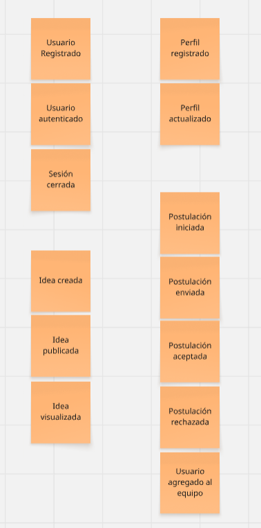

Como segundo paso, identificamos los comandos que disparan o llevan a acabo el evento. Identificamos a estos con un post-it de color azul.

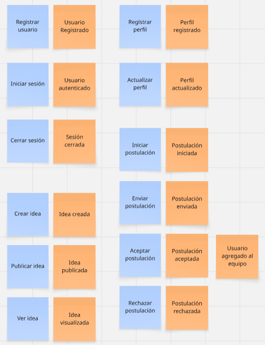

Como tercer paso, identificamos los agentes que realizan o usan el comando. Estos se representan mediante un post-it de color amarillo.

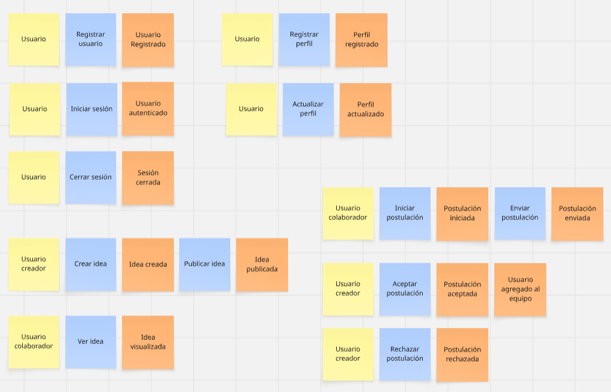

Como último paso, identificamos los eventos que se relacionen entre sí mediante los agregados y entidades que utilizan, agrupandolos porBounded Context.

<h4 id="2511-candidate-context-discovery">2.5.1.1 Candidate Context Discovery</h4>

En esta sesión aplicamos la técnica de Candidate Context Discovery para identificar y separar los posibles Bounded Contexts del sistema IdeaForge. Para ello, utilizamos principalmente la técnica look-for-pivotal-events, la cual permite analizar los eventos que representan cambios importantes dentro del negocio.

Al identificar eventos como UsuarioRegistrado, PerfilRegistrado, IdeaPublicada, PostulaciónEnviada, PostulaciónAceptada, entre otros; pudimos observar que cada uno implicaba responsabilidades y reglas distintas dentro del sistema. Esto nos permitió agrupar dichos eventos en contextos bien definidos, evitando ambigüedad y facilitando la organización del dominio.

Este proceso nos llevó a definir los siguientes Bounded Contexts:

| Bounded Context     | Descripción                                                                 | Eventos clave                                                                 |
|--------------------|-----------------------------------------------------------------------------|------------------------------------------------------------------------------|
| **IAM**            | Maneja el registro, autenticación y control de acceso de los usuarios.     | Usuario Registrado, Usuario Autenticado, Sesión Cerrada                     |
| **Profile**        | Administra la información del perfil del usuario (habilidades e intereses).| Perfil Registrado, Perfil Actualizado                                       |
| **Ideas Management** | Gestiona la creación y publicación de ideas de proyecto.                  | Idea Creada, Idea Publicada                                                 |
| **Exploration**    | Permite explorar ideas y visualizar sus detalles.                          | Idea Visualizada                                                            |
| **Collaboration**  | Gestiona postulaciones y formación de equipos.                             | Postulación Iniciada, Postulación Enviada, Postulación Aceptada, Postulación Rechazada, Usuario Agregado al Equipo |

---

<h4 id="2512-domain-message-flows-modeling">2.5.1.2 Domain Message Flows Modeling</h4>

El Domain Message Flow Modelling es una técnica que permite representar cómo fluyen los mensajes de dominio (commands, events yqueries) entre los distintos bounded contexts del sistema. Su propósito es clarificar las interacciones, dependencias y responsabilidades de cada contexto.

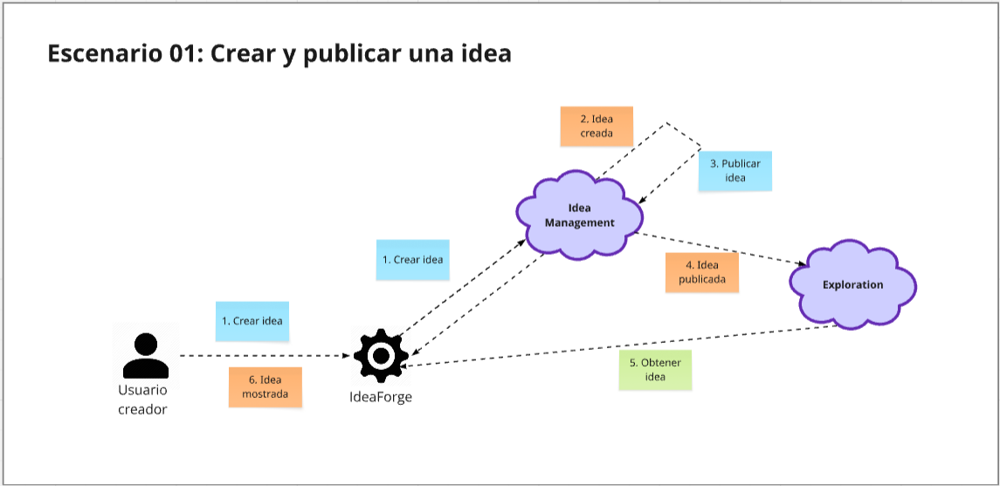
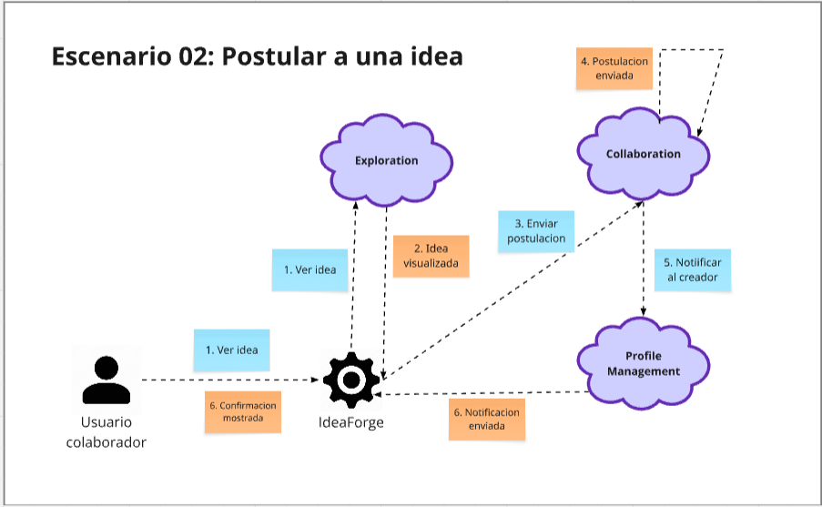
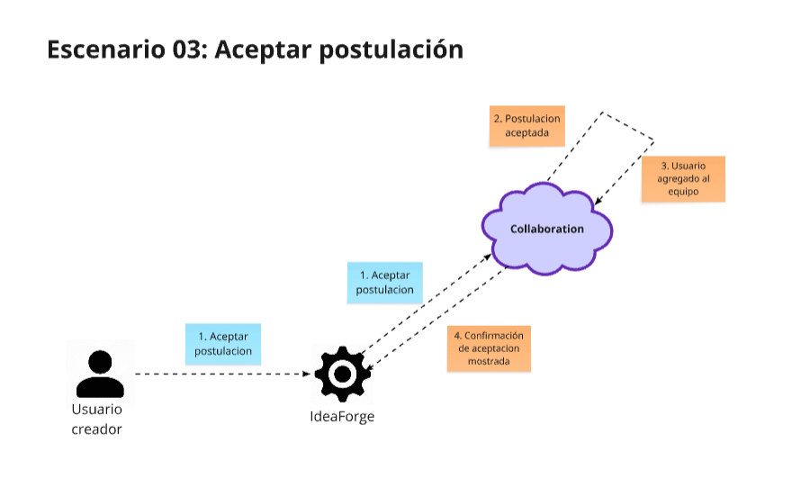
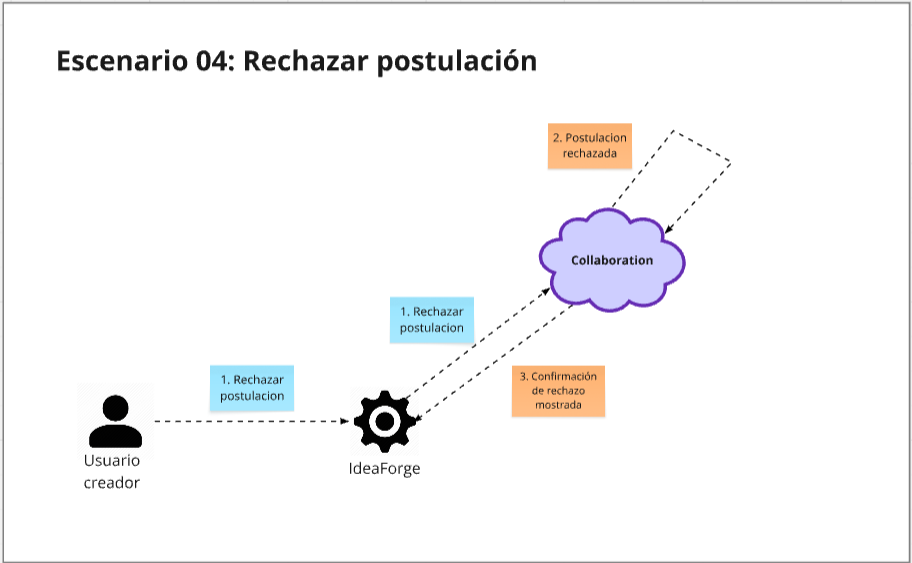

<h4 id="2513-bounded-context-canvases">2.5.1.3 Bounded Context Canvases</h4>

El Bounded Context Canvas es una herramienta visual aplicada en el marco del Domain-Driven Design (DDD) que permite representar demanera clara los límites, responsabilidades e interacciones de cada contexto dentro de un sistema complejo. Su propósito es facilitar que losequipos construyan una visión compartida sobre el nombre y objetivo de cada contexto, las entidades y agregados que lo conforman, asícomo las reglas de negocio que gobiernan su funcionamiento. En esta sección se presentan los Bounded Context Canvases correspondientes a los contextos identificados en nuestro proyecto.

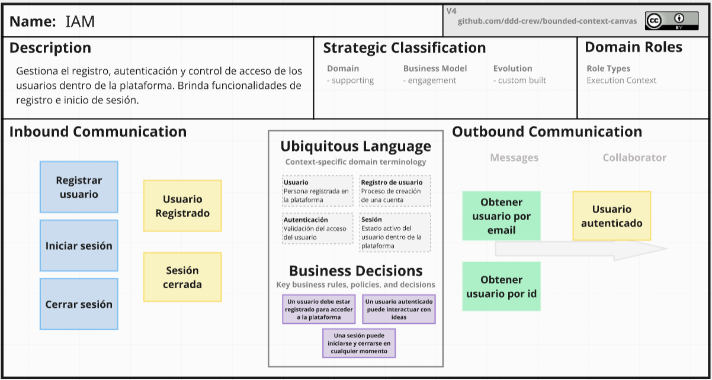
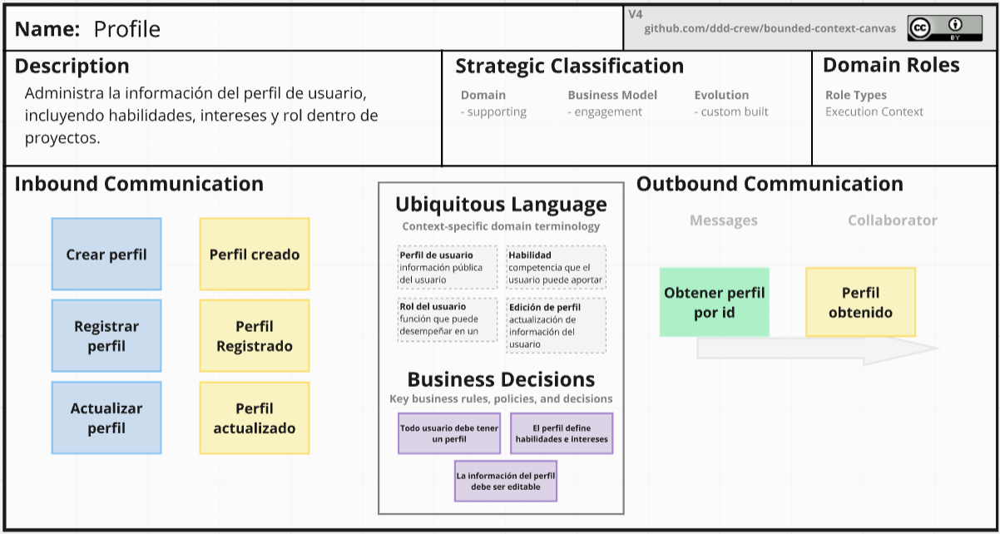
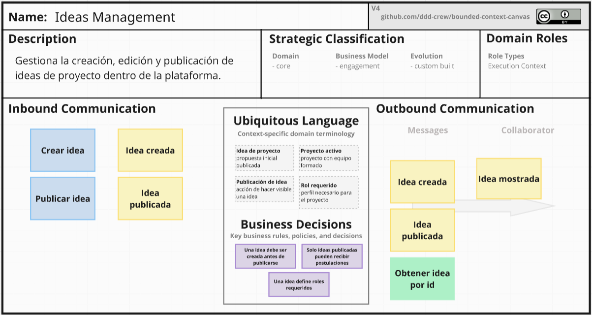
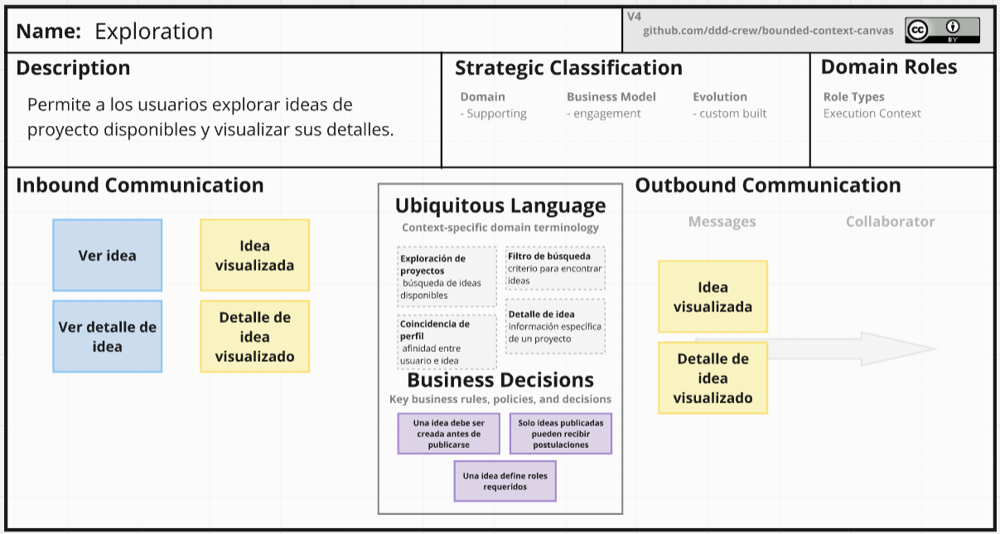
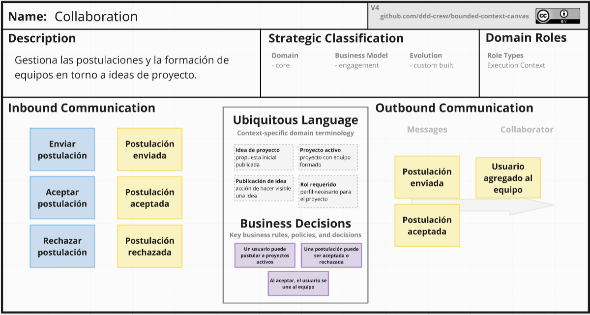

<h3 id="252-context-mapping">2.5.2 Context Mapping</h3>

En esta sección, se ha definido la estructura estratégica de la solución mediante la identificación de los Bounded Contexts y sus relaciones. El proceso de diseño se centró en separar las preocupaciones de gestión de perfiles, la creación de ideas y el proceso de postulación/colaboración.

Durante las sesiones de diseño, se respondieron algunas dudas para validar la robustez y definir las relaciones de los contextos:

- ¿Qué pasaría si unimos Ideas Management con Exploration? 

Se decidió mantenerlos separados. Mientras que Ideas Management se enfoca en la persistencia y reglas de publicación, Exploration se especializa en la visualización eficiente y búsqueda, permitiendo optimizar cada contexto de forma independiente.

- ¿Qué pasaría si Collaboration dependiera directamente de Profile? 

Para evitar que cambios en la estructura de datos del perfil (como nuevas redes sociales o formatos de interés) rompan la lógica de formación de equipos, se determinó el uso de una Anti-corruption Layer (ACL).

- ¿Qué pasaría si aislamos el contexto de IAM? 

Al ser una funcionalidad necesaria pero no el núcleo del negocio, se trata como un Generic Subdomain, permitiendo que el equipo se enfoque en el Core Domain: Collaboration.

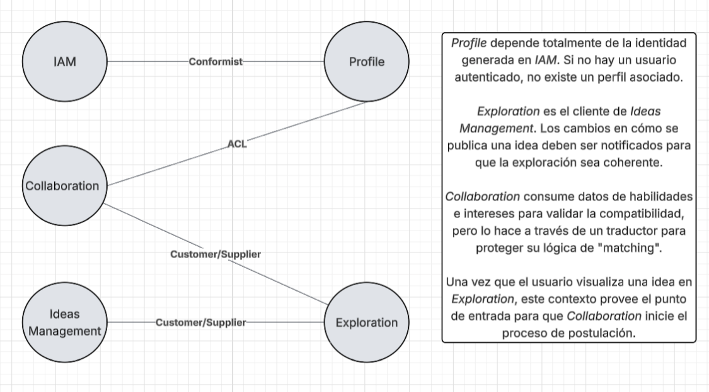

<h3 id="253-software-architecture">2.5.3 Software Architecture</h3>

<h4 id="2531-software-architecture-context-level-diagrams">2.5.3.1 Software Architecture Context Level Diagrams</h4>

Este diagrama muestra a IdeaForge como el sistema central que facilita la conexión entre ideas y colaboradores. El único actor, User, interactúa con el sistema para cumplir ambos roles (creador o colaborador).

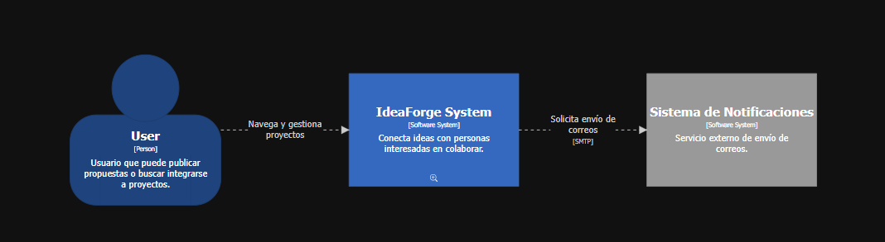

<h4 id="2532-software-architecture-container-level-diagrams">2.5.3.2 Software Architecture Container Level Diagrams</h4>

Este diagrama se definen los cuatro contenedores principales para la interfaz responsiva, la aplicación movil, interfaz de la logica del negocio (API) y la base de datos. 

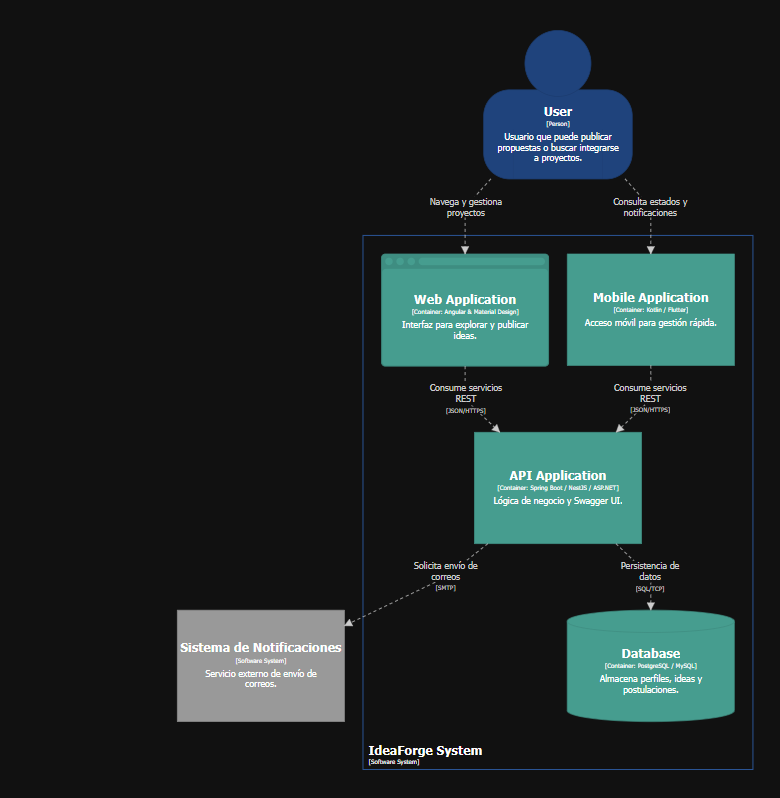

<h4 id="2533-software-architecture-deployment-diagrams">2.5.3.3 Software Architecture Deployment Diagrams</h4>

Este diagrama describe la distribución del entorno en la nube. Se visualizan nodos para el servidor de aplicaciones y nodos de base de datos gestionada, asegurando que los componentes de software se desplieguen sobre infraestructura escalable.

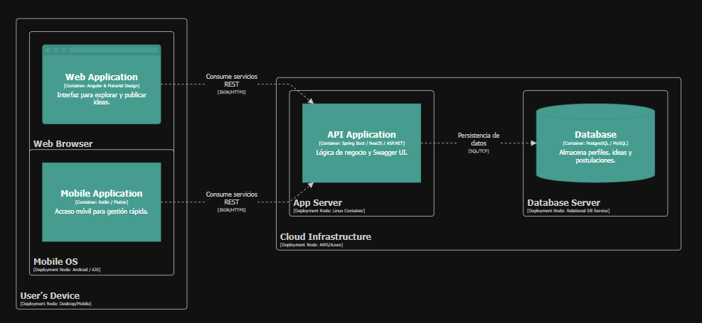

<h2 id="26-tactical-level-domain-driven-design">2.6 Tactical-Level Domain-Driven Design</h2>

<h3 id="26x-bounded-context-bounded-context-iam">2.6.1 Bounded Context: IAM (Identity & Access Management)</h3>

<h4 id="26x1-domain-layer">2.6.1.1 Domain Layer</h4>

<table border="1">
    <thead>
        <tr>
            <th>Clase</th>
            <th>Tipo</th>
            <th>Propósito / Atributos y Métodos</th>
        </tr>
    </thead>
    <tbody>
        <tr>
            <td><strong>Account</strong></td>
            <td>Aggregate Root</td>
            <td>Representa la identidad única del usuario. Atributos: <code>email</code>, <code>passwordHash</code>. Métodos: <code>validateCredentials()</code>, <code>resetPassword()</code>.</td>
        </tr>
        <tr>
            <td><strong>SessionToken</strong></td>
            <td>Value Object</td>
            <td>Encapsula la información del JWT para acceso seguro. Atributos: <code>tokenValue</code>, <code>expirationDate</code>.</td>
        </tr>
        <tr>
            <td><strong>AuthService</strong></td>
            <td>Domain Service</td>
            <td>Lógica para la creación de cuentas y validación de sesiones. Método: <code>registerAccount()</code>.</td>
        </tr>
    </tbody>
</table>

<h4 id="26x2-interface-layer">2.6.1.2 Interface Layer</h4>

- AuthController: Maneja los endpoints /auth/register y /auth/login. Expone la documentación en Swagger para que el frontend sepa cómo enviar las credenciales de forma segura.

<h4 id="26x3-application-layer">2.6.1.3 Application Layer</h4>

Implementa los casos de uso utilizando el patrón CQRS (Command Query Responsibility Segregation). Define los puertos (interfaces) que la infraestructura deberá implementar.

**Commands & Handlers (Mutaciones):**
* `RegisterAccountCommand`: DTO interno con email y password.
* `RegisterAccountCommandHandler`: Orquesta el flujo: verifica si el email existe mediante el repositorio, cifra la contraseña usando el puerto `IPasswordHasher`, crea el Aggregate `Account` y lo persiste.
* `LoginCommand`: DTO interno con email y password.
* `LoginCommandHandler`: Busca la cuenta, verifica el hash de la contraseña y genera un token delegando al puerto `ITokenProvider`.

**Outbound Ports (Interfaces):**
* `IAccountRepository`: Contrato para la persistencia (ej. `save()`, `findByEmail()`).
* `IPasswordHasher`: Contrato para el cifrado (ej. `hash()`, `compare()`).
* `ITokenProvider`: Contrato para la generación de JWT (ej. `generateToken(Account)`).

<h4 id="26x4-infrastructure-layer">2.6.1.4 Infrastructure Layer</h4>

* **Persistence:** `AccountPostgresRepository` implementa `IAccountRepository` usando un ORM (ej. TypeORM/Prisma) para PostgreSQL.
* **Security:** `BcryptPasswordHasher` implementa `IPasswordHasher` y `JwtTokenProvider` implementa `ITokenProvider`.

<h4 id="26x5-bounded-context-software-architecture-component-level-diagrams">2.6.1.5 Bounded Context Software Architecture Component Level Diagrams</h4>

<h4 id="26x6-bounded-context-software-architecture-code-level-diagrams">2.6.1.6 Bounded Context Software Architecture Code Level Diagrams</h4>

<h5 id="26x61-bounded-context-domain-layer-class-diagrams">2.6.1.6.1 Bounded Context Domain Layer Class Diagrams</h5>

<h5 id="26x62-bounded-context-database-design-diagram">2.6.1.6.2 Bounded Context Database Design Diagram</h5>

<h3 id="26x-bounded-context-bounded-context-iam">2.6.2 Bounded Context: Profile</h3>

<h4 id="26x1-domain-layer">2.6.2.1 Domain Layer</h4>

<table border="1">
    <thead>
        <tr>
            <th>Clase</th>
            <th>Tipo</th>
            <th>Propósito / Atributos y Métodos</th>
        </tr>
    </thead>
    <tbody>
        <tr>
            <td><strong>User</strong></td>
            <td>Aggregate Root</td>
            <td>Perfil público del usuario. Atributos: <code>fullName</code>, <code>bio</code>, <code>skills[]</code>, <code>interests[]</code>. Método: <code>updateExperience()</code>.</td>
        </tr>
        <tr>
            <td><strong>Skill</strong></td>
            <td>Value Object</td>
            <td>Representa una competencia técnica. Atributos: <code>name</code>, <code>proficiencyLevel</code>.</td>
        </tr>
        <tr>
            <td><strong>ProfileRepository</strong></td>
            <td>Interface</td>
            <td>Abstracción para la persistencia de perfiles en la base de datos (PostgreSQL/MySQL).</td>
        </tr>
    </tbody>
</table>

<h4 id="26x2-interface-layer">2.6.2.2 Interface Layer</h4>

- ProfileController: Endpoints para /profiles/{id} (GET/PUT). Permite a los usuarios actualizar sus habilidades, intereses y su biografia.

<h4 id="26x3-application-layer">2.6.2.3 Application Layer</h4>

**Commands & Handlers:**
* `UpdateProfileCommand`: DTO con los datos actualizados (`bio`, `skills`, etc.).
* `UpdateProfileCommandHandler`: Recupera el `User`, aplica los cambios y guarda el estado actualizado.

**Outbound Ports:**
* `IProfileRepository`: Interfaz para persistencia (ej. `findById()`, `save()`).

<h4 id="26x4-infrastructure-layer">2.6.2.4 Infrastructure Layer</h4>

* **Persistence:** `ProfilePostgresRepository` implementa `IProfileRepository`, mapeando la entidad `User` y sus `Skills` a PostgreSQL.

<h4 id="26x5-bounded-context-software-architecture-component-level-diagrams">2.6.2.5 Bounded Context Software Architecture Component Level Diagrams</h4>

<h4 id="26x6-bounded-context-software-architecture-code-level-diagrams">2.6.2.6 Bounded Context Software Architecture Code Level Diagrams</h4>

<h5 id="26x61-bounded-context-domain-layer-class-diagrams">2.6.2.6.1 Bounded Context Domain Layer Class Diagrams</h5>

<h5 id="26x62-bounded-context-database-design-diagram">2.6.2.6.2 Bounded Context Database Design Diagram</h5>

<h3 id="26x-bounded-context-bounded-context-iam">2.6.3 Bounded Context: Ideas Management</h3>

<h4 id="26x1-domain-layer">2.6.3.1 Domain Layer</h4>

<table border="1">
    <thead>
        <tr>
            <th>Clase</th>
            <th>Tipo</th>
            <th>Propósito / Atributos y Métodos</th>
        </tr>
    </thead>
    <tbody>
        <tr>
            <td><strong>Idea</strong></td>
            <td>Aggregate Root</td>
            <td>La propuesta inicial. Atributos: <code>title</code>, <code>description</code>, <code>status</code> (Draft, Published). Método: <code>publishIdea()</code>.</td>
        </tr>
        <tr>
            <td><strong>RequiredRole</strong></td>
            <td>Value Object</td>
            <td>Define qué perfiles busca el creador. Atributos: <code>roleName</code>, <code>quantity</code>.</td>
        </tr>
    </tbody>
</table>

<h4 id="26x2-interface-layer">2.6.3.2 Interface Layer</h4>

- IdeaController: Endpoints /ideas (POST) y /ideas/{id} (GET). Incluye validaciones de Swagger para asegurar que el cuerpo del JSON sea correcto antes de llegar al dominio.

<h4 id="26x3-application-layer">2.6.3.3 Application Layer</h4>

**Commands & Handlers:**
* `PublishIdeaCommand`: DTO con la información de la idea y roles requeridos.
* `PublishIdeaCommandHandler`: Ejecuta la lógica de negocio, construye el Aggregate `Idea` y delega su guardado.

**Outbound Ports:**
* `IIdeaRepository`: Contrato para la gestión de datos en la base de datos.

<h4 id="26x4-infrastructure-layer">2.6.3.4 Infrastructure Layer</h4>

* **Persistence:** `IdeaPostgresRepository` implementa `IIdeaRepository`, almacenando las ideas y sus roles asociados.

<h4 id="26x5-bounded-context-software-architecture-component-level-diagrams">2.6.3.5 Bounded Context Software Architecture Component Level Diagrams</h4>

<h4 id="26x6-bounded-context-software-architecture-code-level-diagrams">2.6.3.6 Bounded Context Software Architecture Code Level Diagrams</h4>

<h5 id="26x61-bounded-context-domain-layer-class-diagrams">2.6.3.6.1 Bounded Context Domain Layer Class Diagrams</h5>

<h5 id="26x62-bounded-context-database-design-diagram">2.6.3.6.2 Bounded Context Database Design Diagram</h5>

<h3 id="26x-bounded-context-bounded-context-iam">2.6.4 Bounded Context: Exploration</h3>

<h4 id="26x1-domain-layer">2.6.4.1 Domain Layer</h4>

<table border="1">
    <thead>
        <tr>
            <th>Clase</th>
            <th>Tipo</th>
            <th>Propósito / Atributos y Métodos</th>
        </tr>
    </thead>
    <tbody>
        <tr>
            <td><strong>IdeaView</strong></td>
            <td>Read Model</td>
            <td>Representación optimizada de una idea para visualización rápida. Atributos: <code>id</code>, <code>summary</code>, <code>tags</code>.</td>
        </tr>
        <tr>
            <td><strong>FilterCriteria</strong></td>
            <td>Value Object</td>
            <td>Encapsula los parámetros de búsqueda del usuario. Atributos: <code>keyword</code>, <code>category</code>.</td>
        </tr>
    </tbody>
</table>

<h4 id="26x2-interface-layer">2.6.4.2 Interface Layer</h4>

- ExplorationController: Endpoint /exploration/search (GET). Utiliza Query Params para filtrar los resultados que se muestran en el frontend.

<h4 id="26x3-application-layer">2.6.4.3 Application Layer</h4>

**Queries & Handlers:**
* `SearchIdeasQuery`: Transporta los criterios de filtrado (`FilterCriteria`).
* `SearchIdeasQueryHandler`: Ejecuta la búsqueda apoyándose en modelos de lectura optimizados para alto rendimiento (CQRS Query side).

**Outbound Ports:**
* `IExplorationRepository`: Interfaz de lectura enfocada en búsquedas.

<h4 id="26x4-infrastructure-layer">2.6.4.4 Infrastructure Layer</h4>

* **Persistence:** `ExplorationReadRepository` ejecuta consultas SQL directas o vistas materializadas en PostgreSQL para retornar colecciones de `IdeaView` sin hidratar objetos de dominio pesados.

<h4 id="26x5-bounded-context-software-architecture-component-level-diagrams">2.6.4.5 Bounded Context Software Architecture Component Level Diagrams</h4>

<h4 id="26x6-bounded-context-software-architecture-code-level-diagrams">2.6.4.6 Bounded Context Software Architecture Code Level Diagrams</h4>

<h5 id="26x61-bounded-context-domain-layer-class-diagrams">2.6.4.6.1 Bounded Context Domain Layer Class Diagrams</h5>

<h5 id="26x62-bounded-context-database-design-diagram">2.6.4.6.2 Bounded Context Database Design Diagram</h5>

<h3 id="26x-bounded-context-bounded-context-iam">2.6.5 Bounded Context: Collaboration</h3>

<h4 id="26x1-domain-layer">2.6.5.1 Domain Layer</h4>

<table border="1">
    <thead>
        <tr>
            <th>Clase</th>
            <th>Tipo</th>
            <th>Propósito / Atributos y Métodos</th>
        </tr>
    </thead>
    <tbody>
        <tr>
            <td><strong>Postulación</strong></td>
            <td>Entity</td>
            <td>Registro del interés de un colaborador. Atributos: <code>postulanteId</code>, <code>status</code> (Pendiente, Aceptada). Método: <code>accept()</code>, <code>reject()</code>.</td>
        </tr>
        <tr>
            <td><strong>Equipo</strong></td>
            <td>Aggregate Root</td>
            <td>Conjunto de usuarios colaborando. Atributos: <code>projectId</code>, <code>members[]</code>. Método: <code>addMember()</code>.</td>
        </tr>
        <tr>
            <td><strong>MatchingService</strong></td>
            <td>Domain Service</td>
            <td>Lógica para calcular la afinidad entre el perfil del usuario y los roles requeridos.</td>
        </tr>
    </tbody>
</table>

<h4 id="26x2-interface-layer">2.6.5.2 Interface Layer</h4>

- CollaborationController: Endpoints /collaborations (POST) para que el usuario se postule y /collaborations/{id}/approve (POST) para que acepte nuevos miembros.

<h4 id="26x3-application-layer">2.6.5.3 Application Layer</h4>

**Commands & Handlers:**
* `ApplyCommand`: DTO para registrar una postulación.
* `ApproveCommand`: DTO para aprobar a un candidato.
* `ApproveCommandHandler`: Recupera la `Postulación`, llama a su método `accept()`, y delega al Aggregate `Equipo` la acción de `addMember()`.

**Outbound Ports:**
* `IPostulacionRepository` e `IEquipoRepository` para persistir los cambios de estado.

<h4 id="26x4-infrastructure-layer">2.6.5.4 Infrastructure Layer</h4>

<h4 id="26x5-bounded-context-software-architecture-component-level-diagrams">2.6.5.5 Bounded Context Software Architecture Component Level Diagrams</h4>

<h4 id="26x6-bounded-context-software-architecture-code-level-diagrams">2.6.5.6 Bounded Context Software Architecture Code Level Diagrams</h4>

<h5 id="26x61-bounded-context-domain-layer-class-diagrams">2.6.5.6.1 Bounded Context Domain Layer Class Diagrams</h5>

<h5 id="26x62-bounded-context-database-design-diagram">2.6.5.6.2 Bounded Context Database Design Diagram</h5>
