<h1 id="2-requirements-development-and-software-solution-design">Capítulo II: Requirements Development and Software Solution Design</h1>

<h2 id="21-competidores">2.1 Competidores</h2>

<h3 id="211-analisis-competitivo">2.1.1 Análisis competitivo</h3>

<table border="1">
<thead>
<tr>
<th colspan="7" style="text-align: center;"><b>Competitive Analysis Landscape</b></th>
</tr>
</thead>
<tbody>
<tr>
<td colspan="2" align="center">¿Por qué llevar a cabo este análisis?</td>
<td colspan="5" align="center">El objetivo es definir el posicionamiento de IdeaForge frente a plataformas y comunidades que facilitan conexiones entre fundadores, colaboradores y proyectos en etapa temprana, identificando cómo nuestra propuesta se diferencia al enfocarse específicamente en la formación de equipos alrededor de ideas, y no en la contratación de servicios o la búsqueda de empleo.</td>
</tr>
<tr>
<th></th>
<th></th>
<th><b>IdeaForge</b></th>
<th><b>YC Co-Founder Matching</b></th>
<th><b>CoFoundersLab</b></th>
<th><b>Indie Hackers</b></th>
</tr>
<tr>
<td><strong>Perfil</strong></td>
<td>Overview</td>
<td>Plataforma digital orientada a que emprendedores, estudiantes y creativos publiquen ideas de proyectos y encuentren personas interesadas en unirse según rol, habilidades o intereses. Su propuesta central es facilitar la formación de equipos en etapas tempranas.</td>
<td>Servicio vinculado al ecosistema de Y Combinator orientado a conectar personas que buscan cofundadores para startups. Se apoya en la marca YC y en su enfoque hacia compañías de alto crecimiento.</td>
<td>Red enfocada en conectar emprendedores, cofundadores, asesores e inversionistas. Ofrece una comunidad global con herramientas para buscar perfiles compatibles y ampliar la red de contactos.</td>
<td>Comunidad digital de emprendedores y builders donde los usuarios comparten aprendizajes, productos e ideas para iniciar y hacer crecer negocios online. La colaboración surge más por comunidad que por matching estructurado.</td>
</tr>
<tr>
<td></td>
<td><strong>Ventaja competitiva – ¿Qué valor ofrece al cliente?</strong></td>
<td>Permite conectar ideas con personas dispuestas a construirlas desde etapas tempranas, con un enfoque más accesible y colaborativo para usuarios que aún no tienen una startup consolidada.</td>
<td>Alta credibilidad de marca y fuerte asociación con el ecosistema startup; resulta atractivo para personas que buscan cofundadores con ambición de construir startups escalables.</td>
<td>Gran alcance de red y variedad de perfiles, incluyendo fundadores, advisors e inversionistas, lo que amplía las posibilidades de conexión y networking.</td>
<td>Comunidad activa alrededor de side projects, negocios digitales y aprendizaje entre pares, útil para quienes desean construir en público o descubrir oportunidades de colaboración de manera orgánica.</td>
</tr>
<tr>
<td><strong>Perfil de marketing</strong></td>
<td><strong>Mercado objetivo</strong></td>
<td>Personas con ideas de proyectos que buscan formar equipo y personas con habilidades que desean unirse a iniciativas tempranas, especialmente en entornos académicos, emprendedores y creativos.</td>
<td>Fundadores y futuros fundadores que buscan un cofounder para una startup con potencial de crecimiento, normalmente dentro de un entorno más orientado a venture-backed startups.</td>
<td>Emprendedores, cofundadores, asesores e inversionistas interesados en networking y en la formación de equipos o conexiones estratégicas.</td>
<td>Emprendedores independientes, builders, makers y personas interesadas en lanzar productos o negocios digitales, muchas veces de manera autodidacta y pública.</td>
</tr>
<tr>
<td></td>
<td><strong>Estrategias de marketing</strong></td>
<td>Enfoque en colaboración temprana, claridad de propuesta de valor y construcción de comunidad en universidades, redes sociales y ecosistemas de innovación.</td>
<td>Apalancamiento de la reputación de Y Combinator, contenidos educativos para founders y cercanía con el mundo de startups de alto crecimiento.</td>
<td>Promoción de comunidad global, acceso a expertos y herramientas premium para encontrar cofounders y advisors.</td>
<td>Contenido generado por la comunidad, exposición pública de proyectos, historias de fundadores y aprendizaje compartido entre usuarios.</td>
</tr>
<tr>
<td><strong>Perfil de producto</strong></td>
<td><strong>Productos & servicios</strong></td>
<td>Publicación de ideas, exploración de proyectos, perfiles de usuario con habilidades e intereses, conexión entre creadores de ideas y posibles colaboradores, y funcionalidades futuras para fortalecer el matching y la colaboración.</td>
<td>Matching entre posibles cofundadores dentro del ecosistema YC y acceso a recursos de contenido y comunidad relacionados con startups.</td>
<td>Búsqueda de cofounders, contacto con advisors, networking con otros emprendedores y acceso a opciones premium de interacción.</td>
<td>Comunidad de discusión, visibilidad de proyectos y productos, intercambio de experiencias entre emprendedores y exposición de avances de construcción.</td>
</tr>
<tr>
<td></td>
<td><strong>Precios & costos</strong></td>
<td>Modelo previsto con acceso base accesible y posibilidad de incorporar funcionalidades premium o visibilidad adicional en etapas posteriores.</td>
<td>El valor percibido está altamente ligado al ecosistema YC y su reputación; su principal barrera no es el precio, sino el tipo de perfil y ambición esperada dentro del entorno.</td>
<td>Cuenta con una oferta gratuita limitada y opciones premium para ampliar funcionalidades como búsqueda, mensajería y networking.</td>
<td>Su propuesta gira más alrededor de comunidad y contenidos; la participación inicial resulta accesible, pero no ofrece un sistema de matching estructurado como eje principal.</td>
</tr>
<tr>
<td><strong>Análisis SWOT</strong></td>
<td><strong>Fortalezas</strong></td>
<td>Enfoque claro en conectar ideas con personas para formar equipos desde cero; propuesta más inclusiva para etapas tempranas; cercanía con contextos estudiantiles, creativos y emprendedores.</td>
<td>Marca extremadamente fuerte dentro del ecosistema startup y orientación específica a la búsqueda de cofounders.</td>
<td>Red amplia y madura, con variedad de perfiles y cobertura internacional.</td>
<td>Comunidad reconocida entre builders digitales y fuerte componente de aprendizaje entre pares.</td>
</tr>
<tr>
<td></td>
<td><strong>Debilidades</strong></td>
<td>Startup en etapa inicial que todavía debe validar masa crítica, propuesta de valor y confianza entre usuarios.</td>
<td>Puede percibirse como un espacio más orientado a startups tradicionales de alto crecimiento que a proyectos verdes, académicos o creativos.</td>
<td>Puede generar ruido por amplitud de perfiles y una experiencia menos enfocada específicamente en ideas tempranas.</td>
<td>No está diseñado principalmente como plataforma de matching estructurado entre ideas y colaboradores.</td>
</tr>
<tr>
<td></td>
<td><strong>Oportunidades</strong></td>
<td>Creciente interés por colaboración remota, side projects, emprendimiento universitario y búsqueda de experiencia práctica en proyectos reales.</td>
<td>Continuar capitalizando el prestigio YC y la necesidad constante de cofounders en el mundo startup.</td>
<td>Expandir servicios de networking, asesoría y acompañamiento emprendedor en más geografías.</td>
<td>Seguir atrayendo builders que quieren crear productos digitales y compartir avances públicamente.</td>
</tr>
<tr>
<td></td>
<td><strong>Amenazas</strong></td>
<td>Competidores con mayor reconocimiento de marca, comunidades ya establecidas y plataformas adyacentes que capturan parte de la necesidad de conexión entre perfiles.</td>
<td>Nuevas plataformas de matching más accesibles o especializadas en nichos distintos al de YC.</td>
<td>Saturación de comunidad o disminución de calidad percibida en las conexiones si la experiencia se vuelve demasiado masiva.</td>
<td>Plataformas especializadas en cofounders o matching estructurado que resuelvan mejor la necesidad puntual de formar equipos.</td>
</tr>
</tbody>
</table>

<h3 id="212-estrategias-y-tacticas-frente-a-competidores">2.1.2 Estrategias y tácticas frente a competidores</h3>

Para competir de manera efectiva frente a plataformas de matching de cofounders y comunidades de builders ya posicionadas, <strong>IdeaForge</strong> aplicará estrategias y tácticas enfocadas en su principal diferenciador: facilitar la formación de equipos alrededor de ideas en etapa temprana, con una experiencia más simple, accesible y orientada a la colaboración desde el inicio.

<h4>Enfoque específico en ideas tempranas y no en empleo o freelancing</h4>

<strong>Estrategia:</strong> Posicionar a IdeaForge como una plataforma centrada en construir proyectos desde cero, diferenciándose de espacios enfocados en empleo, servicios o networking general.

<strong>Tácticas:</strong>

<ul>
  <li>Diseñar perfiles y publicaciones orientadas a explicar claramente la idea, su propósito y los roles buscados.</li>
  <li>Destacar visualmente que el objetivo de la plataforma es formar equipos y no contratar servicios.</li>
  <li>Priorizar mensajes de marca asociados a colaboración, co-creación y construcción conjunta.</li>
</ul>

<h4>Accesibilidad para usuarios en etapas tempranas</h4>

<strong>Estrategia:</strong> Reducir la barrera de entrada para estudiantes, emprendedores y creativos que todavía no cuentan con una startup validada o con tracción avanzada.

<strong>Tácticas:</strong>

<ul>
  <li>Permitir publicar ideas sin requerir métricas complejas o validaciones avanzadas como condición inicial.</li>
  <li>Ofrecer plantillas simples para describir problema, objetivo, avance actual y perfiles buscados.</li>
  <li>Facilitar un proceso de incorporación rápido para que nuevos usuarios puedan explorar o publicar sin fricción excesiva.</li>
</ul>

<h4>Matching más claro entre ideas, roles e intereses</h4>

<strong>Estrategia:</strong> Diferenciarse mediante una experiencia de descubrimiento enfocada en afinidad de proyecto, habilidades e intereses, en lugar de depender solo de networking abierto.

<strong>Tácticas:</strong>

<ul>
  <li>Incorporar filtros por rol, habilidades, intereses y tipo de proyecto.</li>
  <li>Mostrar de forma clara qué perfiles necesita cada idea publicada.</li>
  <li>Permitir a los usuarios expresar interés en proyectos de forma simple y directa.</li>
</ul>

<h4>Construcción de confianza y señales de compromiso</h4>

<strong>Estrategia:</strong> Generar mayor confianza entre usuarios para reducir la percepción de riesgo al unirse a una idea o invitar colaboradores.

<strong>Tácticas:</strong>

<ul>
  <li>Permitir que los creadores de ideas muestren avances iniciales, como validaciones, bocetos, descripciones estructuradas o metas definidas.</li>
  <li>Incluir perfiles con habilidades, intereses y nivel de participación esperado.</li>
  <li>Incorporar mecanismos futuros de reputación, actividad o validación comunitaria.</li>
</ul>

<h4>Comunidad temprana y crecimiento en nichos concretos</h4>

<strong>Estrategia:</strong> Iniciar el crecimiento en segmentos donde la necesidad de formar equipos es más visible, en lugar de intentar abarcar desde el inicio un mercado demasiado amplio.

<strong>Tácticas:</strong>

<ul>
  <li>Comenzar con comunidades universitarias, emprendedoras y tecnológicas.</li>
  <li>Difundir la propuesta en espacios donde las personas ya comparten ideas, proyectos o intereses de colaboración.</li>
  <li>Promover casos de uso tempranos donde una idea logre encontrar colaboradores reales dentro de la plataforma.</li>
</ul>

<h4>Diferenciación por experiencia de uso simple y enfocada</h4>

<strong>Estrategia:</strong> Ofrecer una experiencia más directa y comprensible que la de redes amplias o comunidades generalistas, evitando saturación de información o ruido innecesario.

<strong>Tácticas:</strong>

<ul>
  <li>Diseñar una interfaz clara para explorar ideas y perfiles sin complejidad excesiva.</li>
  <li>Presentar la información esencial del proyecto de forma resumida y fácil de comparar.</li>
  <li>Reducir pasos innecesarios para que el usuario pase rápidamente de descubrir a conectar.</li>
</ul>

<h2 id="22-entrevistas">2.2 Entrevistas</h2>

<h3 id="221-diseno-de-entrevistas">2.2.1 Diseño de entrevistas</h3>

Para cualquier entrevistado:

Obtener los siguientes datos:

<ul>
  <li>Nombre completo</li>
  <li>Edad</li>
  <li>Género</li>
  <li>Nivel de educación: (Secundaria, Técnico, Universitario, Posgrado)</li>
  <li>Distrito de residencia</li>
  <li>Ocupación actual</li>
  <li>Área de estudio o especialidad</li>
  <li>¿Actualmente participa en algún proyecto, emprendimiento o iniciativa colaborativa?</li>
</ul>

<h4>Segmento Objetivo 1: Personas con ideas de proyecto que buscan formar equipo</h4>

<strong>Introducción y contexto:</strong>

<ol>
  <li>¿Podrías contarme brevemente qué tipo de idea o proyecto te gustaría desarrollar?</li>
  <li>¿En qué etapa se encuentra actualmente tu idea? (solo concepto, validación inicial, prototipo, otro)</li>
</ol>

<strong>Identificación de pain points (problemas):</strong>

<ol start="3">
  <li>¿Cuál ha sido la principal dificultad que has encontrado para avanzar con tu idea?</li>
  <li>¿Has intentado antes buscar personas para unirte o formar equipo? ¿Cómo fue esa experiencia?</li>
  <li>¿Qué perfiles o habilidades sientes que te faltan para poder desarrollar mejor tu proyecto?</li>
</ol>

<strong>Validación de la solución:</strong>

<ol start="6">
  <li>¿Qué tan útil te resultaría una plataforma donde puedas publicar tu idea y encontrar personas interesadas según rol, habilidades o intereses?</li>
  <li>¿Qué información te gustaría ver en el perfil de una persona antes de invitarla a unirse a tu proyecto?</li>
  <li>Actualmente, ¿por qué no te basta con buscar colaboradores en redes como LinkedIn, grupos de WhatsApp, Discord, Facebook o entre tus propios contactos?</li>
</ol>

<h4>Segmento Objetivo 2: Personas con habilidades o intereses que buscan unirse a proyectos</h4>

<strong>Introducción y contexto:</strong>

<ol>
  <li>¿Qué tipo de habilidades, conocimientos o experiencia consideras que podrías aportar en un proyecto?</li>
  <li>¿Has participado antes en algún proyecto colaborativo, emprendimiento o iniciativa similar? ¿Cómo fue esa experiencia?</li>
</ol>

<strong>Identificación de pain points (problemas):</strong>

<ol start="3">
  <li>Cuando quieres sumarte a un proyecto, ¿cuál es la mayor dificultad que encuentras normalmente?</li>
  <li>¿Qué te genera desconfianza o dudas al momento de considerar unirte a una idea o proyecto de otra persona?</li>
  <li>¿Qué tipo de proyectos te resultan más atractivos para participar y cuáles evitarías?</li>
</ol>

<strong>Validación de la solución:</strong>

<ol start="6">
  <li>¿Qué tan útil te resultaría una plataforma donde puedas explorar ideas publicadas y unirte a aquellas que coincidan con tus intereses o habilidades?</li>
  <li>¿Qué información mínima necesitarías ver sobre un proyecto antes de decidir si te interesa participar?</li>
</ol>

<h3 id="222-registro-de-entrevistas">2.2.2 Registro de entrevistas</h3>

En esta sección se presenta el registro de las entrevistas realizadas a potenciales usuarios de IdeaForge. Las entrevistas permitieron recopilar información sobre las dificultades que enfrentan las personas al intentar formar equipos para desarrollar ideas de proyectos, así como las motivaciones de quienes buscan sumarse a iniciativas colaborativas.

<table border="1">
  <tr>
    <th>Entrevista</th>
    <td>1</td>
    <th>Nombre</th>
    <td>Joagquin Espinoza Arroyo</td>
  </tr>
  <tr>
    <th>Edad</th>
    <td>25</td>
    <th>Distrito</th>
    <td>San Juan de Lurigancho</td>
  </tr>
  <tr>
    <th>Captura de la entrevista: </th>
    <td colspan="3">
      Profesional con interés en desarrollar una idea de emprendimiento digital, pero con dificultades para encontrar personas con habilidades técnicas que puedan ayudarla a convertir su propuesta en un prototipo. Menciona que suele recurrir a contactos personales o redes sociales, pero no siempre encuentra personas realmente comprometidas. Valora una plataforma que permita publicar una idea de forma clara, indicar los roles que necesita y recibir postulaciones de personas interesadas en colaborar.
    </td>
  </tr>
  <tr>
    <th>URL de la grabación</th>
    <td colspan="3">
      <a href="https://upcedupe-my.sharepoint.com/personal/u202312874_upc_edu_pe/_layouts/15/stream.aspx?id=%2Fpersonal%2Fu202312874_upc_edu_pe%2FDocuments%2FEntrevista+-+Segmento+1.mp4&nav=eyJyZWZlcnJhbEluZm8iOnsicmVmZXJyYWxBcHAiOiJTdHJlYW1XZWJBcHAiLCJyZWZlcnJhbFZpZXciOiJTaGFyZURpYWxvZy1MaW5rIiwicmVmZXJyYWxBcHBQbGF0Zm9ybSI6IldlYiIsInJlZmVycmFsTW9kZSI6InZpZXcifX0%3D&ga=1&referrer=StreamWebApp.Web&referrerScenario=AddressBarCopied.view.f1f99a77-8be8-4183-9007-e41746c67521">Ver grabación</a>
    </td>
  </tr>
  <tr>
    <th>Timing</th>
    <td colspan="3">00:00 - 08:59</td>
  </tr>
</table>

 

<table border="1">
  <tr>
    <th>Entrevista</th>
    <td>2</td>
    <th>Nombre</th>
    <td>Victor Solano Armas</td>
  </tr>
  <tr>
    <th>Edad</th>
    <td>24</td>
    <th>Distrito</th>
    <td>Ate</td>
  </tr>
  <tr>
    <th>Captura de la entrevista: </th>
    <td colspan="3">
      Usuaria con experiencia participando en trabajos académicos y proyectos colaborativos. Señala que muchas ideas se quedan solo en conversación porque no existe una forma ordenada de encontrar compañeros con intereses similares. Considera importante que una plataforma muestre el objetivo del proyecto, el nivel de avance, las habilidades requeridas y el compromiso esperado. Destaca que no se uniría a una idea si no entiende claramente qué rol tendría dentro del equipo.
    </td>
  </tr>
  <tr>
    <th>URL de la grabación</th>
    <td colspan="3">
      <a href="https://drive.google.com/file/d/1RnSN2WBJczdMUbi_PhhTiCZlAFM1D8dZ/view">Ver grabación</a>
    </td>
  </tr>
  <tr>
    <th>Timing</th>
    <td colspan="3">00:00 - 11:02</td>
  </tr>
</table>

 

<table border="1">
  <tr>
    <th>Entrevista</th>
    <td>3</td>
    <th>Nombre</th>
    <td>Sofía Martínez</td>
  </tr>
  <tr>
    <th>Edad</th>
    <td>25</td>
    <th>Distrito</th>
    <td>Ate</td>
  </tr>
  <tr>
    <th>Captura de la entrevista: 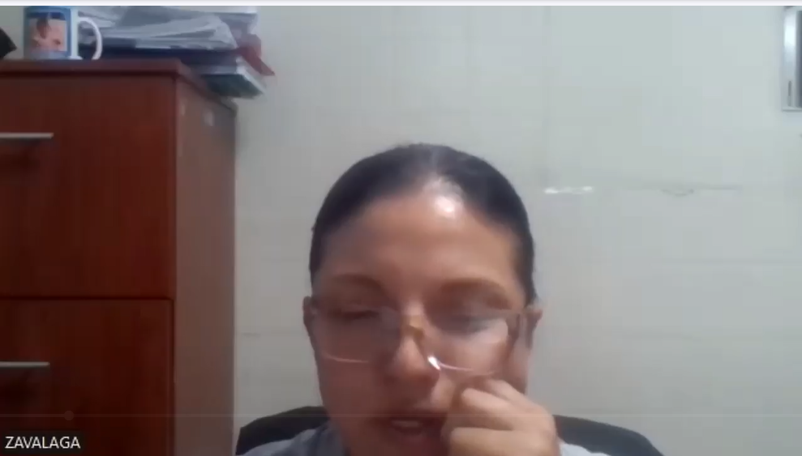</th>
    <td colspan="3">
      Emprendedora interesada en validar una idea de negocio con apoyo de personas de diferentes perfiles. Indica que una de sus principales barreras es no saber dónde encontrar colaboradores confiables fuera de su círculo cercano. También menciona que le gustaría revisar perfiles con habilidades, intereses y experiencia previa antes de invitar a alguien a participar. Considera útil que IdeaForge permita mostrar el estado actual de una idea y los perfiles que se necesitan para avanzar.
    </td>
  </tr>
  <tr>
    <th>URL de la grabación</th>
    <td colspan="3">
      <a href="https://upcedupe-my.sharepoint.com/:v:/g/personal/u202312109_upc_edu_pe/IQAhhLw1RUJ8RImftOIbigcHASxcjFstmEzSn-OgRNJY0cA">Ver grabación</a>
    </td>
  </tr>
  <tr>
    <th>Timing</th>
    <td colspan="3">00:00 - 03:40</td>
  </tr>
</table>

 

 

<table border="1">
  <tr>
    <th>Entrevista</th>
    <td>5</td>
    <th>Nombre</th>
    <td>José Luis Pereda</td>
  </tr>
  <tr>
    <th>Edad</th>
    <td>26</td>
    <th>Distrito</th>
    <td>Santiago de Surco</td>
  </tr>
  <tr>
    <th>Captura de la entrevista: </th>
    <td colspan="3">
      Profesional joven interesado en colaborar en proyectos secundarios relacionados con innovación y tecnología. Señala que suele encontrar ideas en redes sociales o grupos de conversación, pero la información normalmente está desordenada y no permite evaluar si el proyecto es serio. Indica que antes de unirse revisaría la descripción del problema, el objetivo, el equipo actual y el tiempo de dedicación esperado. Valora que la plataforma facilite una primera comunicación entre creador y postulante.
    </td>
  </tr>
  <tr>
    <th>URL de la grabación</th>
    <td colspan="3">
      <a href="https://upcedupe-my.sharepoint.com/:v:/g/personal/u202312109_upc_edu_pe/IQCtmBII4NWTRJOd1p_0c5ZHAY46u89SpsQGZTtVzpUvX8c">Ver grabación</a>
    </td>
  </tr>
  <tr>
    <th>Timing</th>
    <td colspan="3">00:00 - 03:43</td>
  </tr>
</table>

 

<table border="1">
  <tr>
    <th>Entrevista</th>
    <td>6</td>
    <th>Nombre</th>
    <td>Mario Espinoza</td>
  </tr>
  <tr>
    <th>Edad</th>
    <td>24</td>
    <th>Distrito</th>
    <td>Villa El Salvador</td>
  </tr>
  <tr>
    <th>Captura de la entrevista: </th>
    <td colspan="3">
      Usuario con interés en diseño, contenido digital y proyectos creativos. Comenta que le gustaría participar en ideas nuevas, pero le cuesta encontrar proyectos donde su aporte sea realmente necesario. Considera importante que cada publicación indique los roles disponibles, el tipo de colaboración y el estado de la idea. También menciona que guardaría proyectos interesantes para revisarlos después, por lo que valora funcionalidades de exploración, favoritos y postulación simple.
    </td>
  </tr>
  <tr>
    <th>URL de la grabación</th>
    <td colspan="3">
      <a href="https://upcedupe-my.sharepoint.com/:v:/r/personal/u202312109_upc_edu_pe/Documents/Entrevistas%20Segmento%202/Entrevista%20%231.mp4">Ver grabación</a>
    </td>
  </tr>
  <tr>
    <th>Timing</th>
    <td colspan="3">00:00 - 04:50</td>
  </tr>
</table>

<h3 id="223-analisis-de-entrevistas">2.2.3 Análisis de entrevistas</h3>

Las entrevistas se realizaron a un total de 6 participantes con perfiles relacionados al emprendimiento, la formación académica, la tecnología, la creatividad y la participación en proyectos colaborativos. El objetivo fue identificar patrones comunes sobre las dificultades para formar equipos, encontrar colaboradores adecuados y descubrir ideas en las que los usuarios puedan participar.

<h4>Segmento objetivo 1: Personas con ideas de proyecto que buscan formar equipo</h4>

<strong>Total entrevistados asociados al segmento:</strong> 3

<strong>Edades referenciales:</strong> 28 a 41 años

<strong>Características objetivas:</strong>

<ul>
  <li>Los entrevistados manifestaron que cuentan o han contado con ideas de proyecto, pero no siempre tienen un equipo completo para desarrollarlas.</li>
  <li>La búsqueda de colaboradores suele realizarse mediante contactos personales, redes sociales, grupos de WhatsApp, comunidades informales o recomendaciones.</li>
  <li>Los perfiles más difíciles de encontrar son aquellos con habilidades complementarias, especialmente perfiles técnicos, de diseño, negocio o comunicación.</li>
  <li>Existe una necesidad de mostrar la idea de forma clara, indicando objetivo, etapa de avance, roles buscados y expectativas de colaboración.</li>
  <li>Los entrevistados consideran importante revisar información del posible colaborador antes de invitarlo a participar en un proyecto.</li>
</ul>

<strong>Características subjetivas:</strong>

<ul>
  <li>Los usuarios sienten frustración cuando una idea no avanza por falta de equipo o por no encontrar personas realmente interesadas.</li>
  <li>Existe desconfianza al invitar personas externas si no se conoce su nivel de compromiso, habilidades o motivación.</li>
  <li>Los entrevistados valoran una plataforma que ordene el proceso de búsqueda de colaboradores y reduzca la dependencia del círculo cercano.</li>
  <li>La claridad y seriedad de la publicación son factores clave para que una idea resulte atractiva y genere postulaciones.</li>
</ul>

<strong>Conclusiones del segmento:</strong>

<ul>
  <li>IdeaForge debería permitir que los creadores publiquen ideas de manera estructurada, incluyendo descripción, objetivo, etapa de avance y roles necesarios.</li>
  <li>La plataforma debe ayudar a generar confianza mediante perfiles claros de los usuarios, donde se visualicen habilidades, intereses y experiencia relevante.</li>
  <li>El valor principal para este segmento es encontrar personas compatibles que permitan pasar de la idea a una posible ejecución.</li>
  <li>Una publicación incompleta o poco clara puede reducir el interés de los colaboradores, por lo que el formulario de creación de ideas debe guiar al usuario paso a paso.</li>
</ul>

<h4>Segmento objetivo 2: Personas con habilidades o intereses que buscan unirse a proyectos</h4>

<strong>Total entrevistados asociados al segmento:</strong> 3

<strong>Edades referenciales:</strong> 25 a 29 años

<strong>Características objetivas:</strong>

<ul>
  <li>Los entrevistados cuentan con habilidades o intereses que podrían aportar a proyectos, como tecnología, diseño, comunicación, organización o creatividad.</li>
  <li>Actualmente encuentran oportunidades de colaboración de forma dispersa en redes sociales, grupos privados o conversaciones informales.</li>
  <li>Antes de sumarse a una idea, necesitan conocer el propósito del proyecto, el rol requerido, el equipo actual y el nivel de avance.</li>
  <li>Existe interés por participar en proyectos reales para ganar experiencia, construir portafolio, aprender o formar parte de iniciativas con potencial.</li>
  <li>Los entrevistados valoran funciones de exploración, filtros, favoritos y postulación simple.</li>
</ul>

<strong>Características subjetivas:</strong>

<ul>
  <li>Los usuarios sienten incertidumbre cuando una idea no explica claramente qué necesita o qué se espera de los colaboradores.</li>
  <li>Existe una preocupación por invertir tiempo en proyectos poco serios, mal organizados o sin un objetivo definido.</li>
  <li>Los entrevistados valoran una experiencia sencilla que les permita comparar ideas y decidir rápidamente si desean participar.</li>
  <li>La motivación para unirse a proyectos no siempre es económica; también se relaciona con aprendizaje, experiencia, portafolio, contactos y afinidad con la idea.</li>
</ul>

<strong>Conclusiones del segmento:</strong>

<ul>
  <li>IdeaForge debe ofrecer una sección de exploración clara donde los usuarios puedan descubrir proyectos según intereses, habilidades y roles disponibles.</li>
  <li>La información mínima de cada proyecto debe permitir evaluar rápidamente si vale la pena postularse.</li>
  <li>La postulación debe ser simple, directa y acompañada de una primera vía de comunicación entre creador y colaborador potencial.</li>
  <li>El sistema debería permitir guardar proyectos para revisarlos después, ya que no todos los usuarios deciden postularse en el primer contacto.</li>
</ul>

<h4>Conclusión general de las entrevistas</h4>

Los resultados de las entrevistas permiten concluir que IdeaForge responde a una necesidad real de conexión entre personas con ideas y personas con habilidades o intereses para colaborar. En ambos segmentos se identificó que las alternativas actuales, como redes sociales, grupos de mensajería o contactos personales, no resuelven de forma ordenada el proceso de formación de equipos. Por ello, la plataforma debe enfocarse en facilitar publicaciones claras, perfiles confiables, exploración de proyectos, postulación simple y comunicación inicial entre usuarios. Estas necesidades se alinean directamente con la propuesta central de IdeaForge: formar equipos alrededor de ideas en etapa temprana.

<h2 id="23-needfinding">2.3 Needfinding</h2>

<h3 id="231-user-personas">2.3.1 User Personas</h3>

### Segmento 1: Emprendedora en etapa inicial
Usuario que tiene una idea de proyecto y necesita encontrar personas con habilidades complementarias para convertirla en una propuesta real.

### Segmento 2: Estudiante que busca ganar experiencia práctica
Usuario que desea integrarse a proyectos para aplicar sus conocimientos, aprender en un entorno real y fortalecer su perfil profesional.

<h3 id="232-user-task-matrix">2.3.2 User Task Matrix</h3>

En esta sección se presenta el **User Task Matrix**, que concentra las tareas que los **User Persona** realizan para cumplir sus objetivos. Estas tareas no corresponden a funcionalidades de software, sino a actividades que los segmentos realizan independientemente de la existencia de la solución.

Se consideran dos segmentos principales:

- **Valeria Rojas**: emprendedora en etapa inicial.
- **Diego Mendoza**: estudiante que busca ganar experiencia práctica.

| Tarea (Task) | Valeria – Frecuencia | Valeria – Importancia | Diego – Frecuencia | Diego – Importancia |
|---|---|---|---|---|
| Identificar oportunidades para desarrollar una idea o participar en un proyecto | Media | Alta | Alta | Alta |
| Buscar personas con intereses afines para colaborar | Alta | Alta | Media | Alta |
| Explicar su perfil, motivaciones o propuesta a otras personas | Alta | Alta | Alta | Alta |
| Evaluar si una idea o proyecto tiene potencial y vale la pena | Alta | Alta | Alta | Alta |
| Identificar qué tipo de apoyo o rol necesita un proyecto | Alta | Alta | Media | Media |
| Identificar en qué tipo de proyecto puede aportar según sus habilidades | Media | Alta | Alta | Alta |
| Buscar espacios donde conectarse con posibles colaboradores o equipos | Alta | Alta | Alta | Alta |
| Comparar distintas opciones antes de comprometerse con una colaboración | Media | Alta | Alta | Alta |
| Demostrar compromiso, capacidades o interés para generar confianza | Alta | Alta | Alta | Alta |
| Coordinar conversaciones iniciales con posibles colaboradores o equipos | Alta | Alta | Media | Alta |
| Evaluar si las personas con las que trabajará son confiables y compatibles | Alta | Alta | Media | Alta |
| Decidir si se compromete o no con una idea, proyecto o equipo | Alta | Alta | Alta | Alta |
| Organizar el trabajo inicial con otras personas | Alta | Alta | Baja | Media |
| Aprender de la experiencia obtenida en colaboraciones o proyectos | Media | Media | Alta | Alta |

### Análisis
La matriz muestra coincidencias importantes entre ambos segmentos, especialmente en tareas como:

- evaluar si una idea o proyecto vale la pena,
- explicar su perfil o propuesta,
- buscar espacios para conectarse con otros,
- decidir si comprometerse con una colaboración.

Sin embargo, también existen diferencias claras:

- **Valeria** se enfoca más en buscar colaboradores, coordinar conversaciones, identificar roles necesarios y organizar el trabajo inicial.
- **Diego** se enfoca más en encontrar proyectos donde pueda aportar, comparar oportunidades y aprender de la experiencia obtenida.

Estas diferencias permiten entender que **deaForge** debe responder tanto a quienes proponen ideas como a quienes buscan integrarse a ellas.

<h3 id="233-user-journey-mapping">2.3.3 User Journey Mapping</h3>

<h3 id="234-empathy-mapping">2.3.4 Empathy Mapping</h3>

### Segmento objetivo 1: Emprendedora en etapa inicial

### Segmento objetivo 2: Estudiante en búsqueda de experiencia

<h3 id="235-big-picture-eventstorming">2.3.5 Big Picture EventStorming</h3>

<h3 id="236-ubiquitous-language">2.3.6 Ubiquitous Language</h3>

El lenguaje ubicuo es una parte fundamental de la estrategia de UX. Se refiere al conjunto de términos y frases que, aunque no pertenecen al contexto técnico del desarrollo, se utilizan para expresar la lógica del negocio. Esto permite que todos los involucrados en el proyecto, incluidos los usuarios finales, puedan entender y participar mejor en el desarrollo del producto.

### Glosario

**Usuario**  
Persona registrada en la plataforma que puede interactuar con ideas de proyecto, ya sea publicando una propuesta o buscando integrarse a una existente.

**Perfil de usuario**  
Información pública y relevante de cada usuario dentro de la plataforma, incluyendo nombre, habilidades, intereses, experiencia y rol con el que desea participar en proyectos.

**Idea de proyecto**  
Propuesta inicial publicada por un usuario con el fin de presentar una iniciativa y atraer personas interesadas en desarrollarla de manera colaborativa.

**Proyecto**  
Idea estructurada que cuenta con una descripción más definida, objetivos claros y necesidades específicas para su desarrollo en equipo.

**Creador de proyecto**  
Usuario que publica una idea o proyecto en la plataforma y busca formar un equipo para llevarlo a cabo. Generalmente cumple un rol de liderazgo o coordinación inicial.

**Colaborador**  
Usuario que desea participar en un proyecto aportando conocimientos, habilidades o experiencia en un rol específico.

**Equipo**  
Conjunto de usuarios que se unen alrededor de una idea o proyecto para trabajar de manera colaborativa en su desarrollo.

**Rol requerido**  
Función o perfil que el creador del proyecto necesita incorporar al equipo, como desarrollador móvil, backend, diseñador UX/UI, marketing, entre otros.

**Habilidad**  
Competencia o conocimiento que un usuario puede aportar al proyecto. Puede ser técnica, creativa, organizativa o de negocio.

**Interés**  
Área temática, tipo de proyecto o campo de aplicación con el que un usuario se siente identificado y en el que desea colaborar.

**Postulación**  
Acción mediante la cual un usuario expresa su interés en formar parte de un proyecto determinado.

**Postulante**  
Usuario que ha enviado una postulación para integrarse a un proyecto y se encuentra a la espera de ser evaluado por el creador.

**Estado de postulación**  
Condición en la que se encuentra una postulación dentro del proceso de selección. Puede ser pendiente, aceptada o rechazada.

**Compatibilidad**  
Grado de afinidad entre el perfil de un usuario y las necesidades de un proyecto, considerando habilidades, intereses, experiencia y rol requerido.

**Convocatoria**  
Llamado realizado por el creador del proyecto para atraer personas interesadas en participar en la idea propuesta.

**Proyecto en formación**  
Proyecto que aún se encuentra en etapa de búsqueda de integrantes y todavía no cuenta con el equipo completo para iniciar su desarrollo.

**Proyecto activo**  
Proyecto que ya cuenta con un equipo base conformado y puede empezar a ejecutar actividades para su desarrollo.

**Colaboración**  
Participación conjunta entre varios usuarios con el objetivo de aportar al avance y construcción de un proyecto común.

**Compromiso**  
Nivel de responsabilidad, constancia y disposición de un usuario para participar activamente dentro de un proyecto.

**Coincidencia de perfil**  
Relación entre las características de un usuario y las necesidades de un proyecto, utilizada para identificar posibles oportunidades de integración.

**Exploración de proyectos**  
Proceso mediante el cual un usuario revisa distintas ideas o proyectos disponibles para identificar oportunidades de participación.

**Formación de equipo**  
Proceso de reunir usuarios con perfiles complementarios alrededor de una idea o proyecto para iniciar su desarrollo.

### Términos a evitar
- **Cliente**
- **Freelancer**
- **Proveedor**
- **Empleo formal**
- **Venta de servicios**

Estos términos no representan adecuadamente la propuesta de valor de **deaForge**, ya que la plataforma no está orientada a la contratación o comercialización de servicios, sino a la formación de equipos alrededor de ideas de proyecto.

<h2 id="24-requirements-specification">2.4 Requirements specification</h2>

<h2 id="241-user-stories">2.4.1 User Stories</h2>

En esta sección se presentan las épicas del producto IdeaForge, redactadas para organizar los requisitos funcionales y no funcionales que guían el alcance del proyecto.

<h3 id="2411-epics">2.4.1.1 Epics</h3>

<table border="1" style="border-collapse: collapse; width: 100%; font-size: 0.95rem;">
  <thead>
    <tr>
      <th style="padding: 0.5rem;">Epic ID</th>
      <th style="padding: 0.5rem;">Título</th>
      <th style="padding: 0.5rem;">Descripción</th>
    </tr>
  </thead>
  <tbody>
    <tr>
      <td style="padding: 0.5rem;">E01</td>
      <td style="padding: 0.5rem;">Gestión de cuentas y perfiles</td>
      <td style="padding: 0.5rem;">Como usuario de IdeaForge, quiero registrarme, autenticarme y gestionar mi perfil, para participar dentro de la plataforma con información clara sobre mis intereses y habilidades.</td>
    </tr>
    <tr>
      <td style="padding: 0.5rem;">E02</td>
      <td style="padding: 0.5rem;">Publicación y gestión de ideas</td>
      <td style="padding: 0.5rem;">Como creador de ideas, quiero publicar, editar y administrar mis proyectos, para atraer colaboradores adecuados y dar visibilidad a mis iniciativas.</td>
    </tr>
    <tr>
      <td style="padding: 0.5rem;">E03</td>
      <td style="padding: 0.5rem;">Exploración y descubrimiento</td>
      <td style="padding: 0.5rem;">Como usuario interesado en colaborar, quiero explorar ideas y filtrarlas por criterios relevantes, para encontrar proyectos alineados con mis habilidades e intereses.</td>
    </tr>
    <tr>
      <td style="padding: 0.5rem;">E04</td>
      <td style="padding: 0.5rem;">Postulación y conexión entre usuarios</td>
      <td style="padding: 0.5rem;">Como usuario, quiero mostrar interés en proyectos y comunicarme con otros participantes, para formar equipos y coordinar colaboraciones.</td>
    </tr>
    <tr>
      <td style="padding: 0.5rem;">E05</td>
      <td style="padding: 0.5rem;">Confianza, visibilidad y seguimiento</td>
      <td style="padding: 0.5rem;">Como usuario, quiero visualizar avances, estados y señales de seriedad de los proyectos, para tomar mejores decisiones al crear o unirme a una idea.</td>
    </tr>
    <tr>
      <td style="padding: 0.5rem;">E06</td>
      <td style="padding: 0.5rem;">Administración y seguridad de la plataforma</td>
      <td style="padding: 0.5rem;">Como administrador de la plataforma, quiero gestionar moderación, sesiones y seguridad básica, para asegurar una experiencia confiable para todos los usuarios.</td>
    </tr>
  </tbody>
</table>

<h3 id="2412-user-stories">2.4.1.2 User Stories</h3>

Requisitos definidos junto con el conjunto de User Stories y Epics para los requisitos identificados. Los User Stories incluyen Acceptance Criteria.

<table border="1" style="border-collapse: collapse; width: 100%; font-size: 0.95rem;">
  <thead>
    <tr>
      <th style="padding: 0.5rem;">User Story ID</th>
      <th style="padding: 0.5rem;">Título</th>
      <th style="padding: 0.5rem;">Descripción</th>
      <th style="padding: 0.5rem;">Criterios de Aceptación</th>
      <th style="padding: 0.5rem;">Relacionado con (Epic ID)</th>
    </tr>
  </thead>
  <tbody>
    <tr>
      <td style="padding: 0.5rem;">US01</td>
      <td style="padding: 0.5rem;">Registro de usuario</td>
      <td style="padding: 0.5rem;">Como visitante, quiero crear una cuenta en IdeaForge, para acceder a las funcionalidades de la plataforma.</td>
      <td style="padding: 0.5rem;">Escenario 1: Registro exitoso DADO que el visitante completa el formulario con datos válidos CUANDO presiona registrarse ENTONCES el sistema debe crear su cuenta correctamente  Escenario 2: Validación de campos obligatorios DADO que el visitante deja campos vacíos CUANDO intenta registrarse ENTONCES el sistema debe mostrar mensajes de validación  Escenario 3: Correo duplicado DADO que el correo ya existe en el sistema CUANDO intenta crear una nueva cuenta ENTONCES el sistema debe rechazar el registro por duplicidad</td>
      <td style="padding: 0.5rem;">E01</td>
    </tr>
    <tr>
      <td style="padding: 0.5rem;">US02</td>
      <td style="padding: 0.5rem;">Inicio de sesión</td>
      <td style="padding: 0.5rem;">Como usuario registrado, quiero iniciar sesión, para acceder a mi cuenta y mis funcionalidades personalizadas.</td>
      <td style="padding: 0.5rem;">Escenario 1: Inicio de sesión correcto DADO que el usuario ingresa credenciales válidas CUANDO presiona iniciar sesión ENTONCES el sistema debe permitir el acceso  Escenario 2: Credenciales inválidas DADO que el usuario ingresa datos incorrectos CUANDO intenta autenticarse ENTONCES el sistema debe mostrar un mensaje de error  Escenario 3: Redirección al panel principal DADO que el usuario inició sesión exitosamente CUANDO ingresa a la plataforma ENTONCES el sistema debe llevarlo a su vista principal</td>
      <td style="padding: 0.5rem;">E01</td>
    </tr>
    <tr>
      <td style="padding: 0.5rem;">US03</td>
      <td style="padding: 0.5rem;">Edición de perfil</td>
      <td style="padding: 0.5rem;">Como usuario, quiero editar mi perfil, para mostrar mis habilidades, intereses y una descripción personal.</td>
      <td style="padding: 0.5rem;">Escenario 1: Actualizar perfil correctamente DADO que el usuario modifica sus datos CUANDO guarda los cambios ENTONCES el sistema debe actualizar su perfil  Escenario 2: Visualizar cambios realizados DADO que el perfil fue actualizado CUANDO el usuario o terceros lo consultan ENTONCES deben visualizar la información actualizada  Escenario 3: Validar formato de campos DADO que el usuario ingresa datos inválidos CUANDO intenta guardar ENTONCES el sistema debe mostrar validaciones correspondientes</td>
      <td style="padding: 0.5rem;">E01</td>
    </tr>
    <tr>
      <td style="padding: 0.5rem;">US04</td>
      <td style="padding: 0.5rem;">Selección de intereses y habilidades</td>
      <td style="padding: 0.5rem;">Como usuario, quiero registrar mis intereses y habilidades, para recibir una experiencia más alineada a mi perfil.</td>
      <td style="padding: 0.5rem;">Escenario 1: Guardar intereses y habilidades DADO que el usuario selecciona opciones válidas CUANDO confirma su elección ENTONCES el sistema debe guardar esa información en su perfil  Escenario 2: Editar selección previa DADO que el usuario ya tiene intereses registrados CUANDO decide modificarlos ENTONCES el sistema debe actualizar la selección  Escenario 3: Mostrar coincidencias relevantes DADO que el usuario completó su perfil CUANDO explora la plataforma ENTONCES el sistema debe poder usar esa información para mejorar recomendaciones o filtros</td>
      <td style="padding: 0.5rem;">E01</td>
    </tr>
    <tr>
      <td style="padding: 0.5rem;">US05</td>
      <td style="padding: 0.5rem;">Creación de idea o proyecto</td>
      <td style="padding: 0.5rem;">Como creador, quiero publicar una idea o proyecto, para atraer personas interesadas en unirse.</td>
      <td style="padding: 0.5rem;">Escenario 1: Publicación exitosa DADO que el creador completa el formulario con datos válidos CUANDO publica la idea ENTONCES el sistema debe registrar el proyecto correctamente  Escenario 2: Validar campos obligatorios DADO que faltan datos esenciales del proyecto CUANDO intenta publicarlo ENTONCES el sistema debe bloquear la acción y mostrar errores  Escenario 3: Mostrar proyecto publicado DADO que la idea fue publicada CUANDO otros usuarios exploran proyectos ENTONCES el sistema debe mostrarla en el listado correspondiente</td>
      <td style="padding: 0.5rem;">E02</td>
    </tr>
    <tr>
      <td style="padding: 0.5rem;">US06</td>
      <td style="padding: 0.5rem;">Edición de idea o proyecto</td>
      <td style="padding: 0.5rem;">Como creador, quiero editar la información de mi proyecto, para mantenerla actualizada.</td>
      <td style="padding: 0.5rem;">Escenario 1: Editar proyecto correctamente DADO que el creador ingresa a su proyecto CUANDO modifica datos y guarda ENTONCES el sistema debe actualizar la información  Escenario 2: Restringir edición a propietario DADO que un usuario no es dueño del proyecto CUANDO intenta editarlo ENTONCES el sistema debe denegar el acceso  Escenario 3: Mostrar cambios actualizados DADO que el proyecto fue editado CUANDO otros usuarios lo consultan ENTONCES deben ver la versión más reciente</td>
      <td style="padding: 0.5rem;">E02</td>
    </tr>
    <tr>
      <td style="padding: 0.5rem;">US07</td>
      <td style="padding: 0.5rem;">Eliminación o desactivación de proyecto</td>
      <td style="padding: 0.5rem;">Como creador, quiero desactivar o eliminar mi proyecto, para dejar de mostrarlo cuando ya no esté disponible.</td>
      <td style="padding: 0.5rem;">Escenario 1: Desactivar proyecto DADO que el creador selecciona desactivar CUANDO confirma la acción ENTONCES el sistema debe ocultar el proyecto del listado público  Escenario 2: Confirmar eliminación DADO que el creador desea eliminar el proyecto CUANDO presiona eliminar ENTONCES el sistema debe solicitar confirmación previa  Escenario 3: Restringir eliminación a propietario DADO que otro usuario intenta eliminar un proyecto ajeno CUANDO ejecuta la acción ENTONCES el sistema debe rechazarla</td>
      <td style="padding: 0.5rem;">E02</td>
    </tr>
    <tr>
      <td style="padding: 0.5rem;">US08</td>
      <td style="padding: 0.5rem;">Definición de roles buscados</td>
      <td style="padding: 0.5rem;">Como creador, quiero indicar qué roles busco para mi proyecto, para atraer colaboradores adecuados.</td>
      <td style="padding: 0.5rem;">Escenario 1: Registrar roles buscados DADO que el creador completa la sección de roles CUANDO guarda el proyecto ENTONCES el sistema debe mostrar los roles requeridos  Escenario 2: Editar roles requeridos DADO que el creador cambia las necesidades de su proyecto CUANDO actualiza la información ENTONCES el sistema debe reflejar los nuevos roles  Escenario 3: Mostrar roles a los postulantes DADO que un usuario consulta el proyecto CUANDO revisa su detalle ENTONCES debe visualizar claramente los perfiles buscados</td>
      <td style="padding: 0.5rem;">E02</td>
    </tr>
    <tr>
      <td style="padding: 0.5rem;">US09</td>
      <td style="padding: 0.5rem;">Exploración de proyectos</td>
      <td style="padding: 0.5rem;">Como usuario, quiero explorar ideas publicadas, para descubrir proyectos que me interesen.</td>
      <td style="padding: 0.5rem;">Escenario 1: Listar proyectos disponibles DADO que existen proyectos activos CUANDO el usuario ingresa a la sección de exploración ENTONCES el sistema debe mostrar el listado de ideas publicadas  Escenario 2: Ocultar proyectos inactivos DADO que un proyecto está desactivado CUANDO el usuario explora ideas ENTONCES el sistema no debe mostrarlo como disponible  Escenario 3: Acceder al detalle del proyecto DADO que el usuario encuentra un proyecto interesante CUANDO selecciona verlo ENTONCES el sistema debe mostrar su información detallada</td>
      <td style="padding: 0.5rem;">E03</td>
    </tr>
    <tr>
      <td style="padding: 0.5rem;">US10</td>
      <td style="padding: 0.5rem;">Búsqueda por palabra clave</td>
      <td style="padding: 0.5rem;">Como usuario, quiero buscar proyectos por palabras clave, para encontrar ideas relacionadas con mis intereses.</td>
      <td style="padding: 0.5rem;">Escenario 1: Buscar proyectos por término DADO que el usuario escribe una palabra clave CUANDO ejecuta la búsqueda ENTONCES el sistema debe mostrar proyectos coincidentes  Escenario 2: Manejar búsqueda sin resultados DADO que no existen proyectos coincidentes CUANDO el usuario realiza la búsqueda ENTONCES el sistema debe informar que no se encontraron resultados  Escenario 3: Limpiar búsqueda DADO que el usuario desea volver al listado general CUANDO limpia el término buscado ENTONCES el sistema debe mostrar nuevamente los proyectos disponibles</td>
      <td style="padding: 0.5rem;">E03</td>
    </tr>
    <tr>
      <td style="padding: 0.5rem;">US11</td>
      <td style="padding: 0.5rem;">Filtrado por rol, habilidad o interés</td>
      <td style="padding: 0.5rem;">Como usuario, quiero filtrar proyectos según rol, habilidad o interés, para encontrar oportunidades más relevantes.</td>
      <td style="padding: 0.5rem;">Escenario 1: Aplicar filtros válidos DADO que el usuario selecciona filtros disponibles CUANDO los aplica ENTONCES el sistema debe mostrar solo proyectos relevantes  Escenario 2: Combinar varios filtros DADO que el usuario selecciona más de un criterio CUANDO ejecuta el filtrado ENTONCES el sistema debe combinar correctamente los resultados  Escenario 3: Restablecer filtros DADO que el usuario quiere volver a la vista completa CUANDO elimina los filtros aplicados ENTONCES el sistema debe mostrar todos los proyectos activos</td>
      <td style="padding: 0.5rem;">E03</td>
    </tr>
    <tr>
      <td style="padding: 0.5rem;">US12</td>
      <td style="padding: 0.5rem;">Visualización del detalle de un proyecto</td>
      <td style="padding: 0.5rem;">Como usuario, quiero ver el detalle completo de un proyecto, para evaluar si me interesa participar.</td>
      <td style="padding: 0.5rem;">Escenario 1: Mostrar información principal DADO que el usuario ingresa al detalle de un proyecto CUANDO lo consulta ENTONCES el sistema debe mostrar descripción, objetivo, roles buscados y creador  Escenario 2: Mostrar información adicional relevante DADO que el proyecto tiene datos complementarios CUANDO el usuario lo revisa ENTONCES el sistema debe mostrar categoría, estado y expectativas de colaboración  Escenario 3: Restringir acceso a proyectos eliminados DADO que el proyecto ya no está disponible CUANDO el usuario intenta acceder al detalle ENTONCES el sistema debe informar que el proyecto no está disponible</td>
      <td style="padding: 0.5rem;">E03</td>
    </tr>
    <tr>
      <td style="padding: 0.5rem;">US13</td>
      <td style="padding: 0.5rem;">Postulación a proyecto</td>
      <td style="padding: 0.5rem;">Como usuario interesado, quiero postularme a un proyecto, para expresar mi interés en participar.</td>
      <td style="padding: 0.5rem;">Escenario 1: Postulación exitosa DADO que el usuario revisa un proyecto activo CUANDO presiona postularme y confirma ENTONCES el sistema debe registrar su interés  Escenario 2: Evitar postulación duplicada DADO que el usuario ya se postuló al proyecto CUANDO intenta hacerlo nuevamente ENTONCES el sistema debe bloquear la duplicidad  Escenario 3: Restringir postulación en proyecto inactivo DADO que el proyecto está cerrado o inactivo CUANDO el usuario intenta postularse ENTONCES el sistema debe impedir la acción</td>
      <td style="padding: 0.5rem;">E04</td>
    </tr>
    <tr>
      <td style="padding: 0.5rem;">US14</td>
      <td style="padding: 0.5rem;">Visualización de postulantes</td>
      <td style="padding: 0.5rem;">Como creador, quiero ver quiénes se han postulado a mi proyecto, para evaluar posibles colaboradores.</td>
      <td style="padding: 0.5rem;">Escenario 1: Ver lista de postulantes DADO que existen usuarios postulados CUANDO el creador consulta su proyecto ENTONCES el sistema debe mostrar la lista correspondiente  Escenario 2: Ver perfil del postulante DADO que el creador revisa un postulante específico CUANDO abre su perfil ENTONCES debe visualizar sus habilidades e intereses  Escenario 3: Restringir acceso a terceros DADO que un usuario ajeno intenta ver postulantes CUANDO ingresa a esa sección ENTONCES el sistema debe denegar el acceso</td>
      <td style="padding: 0.5rem;">E04</td>
    </tr>
    <tr>
      <td style="padding: 0.5rem;">US15</td>
      <td style="padding: 0.5rem;">Aceptación o rechazo de postulaciones</td>
      <td style="padding: 0.5rem;">Como creador, quiero aceptar o rechazar postulaciones, para gestionar quién se une a mi proyecto.</td>
      <td style="padding: 0.5rem;">Escenario 1: Aceptar postulante DADO que existe una postulación pendiente CUANDO el creador la acepta ENTONCES el sistema debe registrar al usuario como integrante o aceptado  Escenario 2: Rechazar postulante DADO que el creador decide no continuar con una postulación CUANDO la rechaza ENTONCES el sistema debe actualizar su estado  Escenario 3: Mostrar estado actualizado DADO que la postulación fue gestionada CUANDO el creador o postulante consultan su estado ENTONCES el sistema debe reflejar la decisión tomada</td>
      <td style="padding: 0.5rem;">E04</td>
    </tr>
    <tr>
      <td style="padding: 0.5rem;">US16</td>
      <td style="padding: 0.5rem;">Mensajería entre creador y postulante</td>
      <td style="padding: 0.5rem;">Como usuario, quiero intercambiar mensajes con otros participantes, para conversar sobre una posible colaboración.</td>
      <td style="padding: 0.5rem;">Escenario 1: Enviar mensaje DADO que existe relación entre proyecto y usuario interesado CUANDO uno de ellos redacta y envía un mensaje ENTONCES el sistema debe registrarlo y mostrarlo en la conversación  Escenario 2: Visualizar historial de mensajes DADO que existen mensajes previos CUANDO los usuarios abren la conversación ENTONCES deben visualizar el historial correspondiente  Escenario 3: Restringir mensajes vacíos DADO que el usuario intenta enviar un mensaje sin contenido CUANDO presiona enviar ENTONCES el sistema debe bloquear la acción</td>
      <td style="padding: 0.5rem;">E04</td>
    </tr>
    <tr>
      <td style="padding: 0.5rem;">US17</td>
      <td style="padding: 0.5rem;">Notificaciones de actividad</td>
      <td style="padding: 0.5rem;">Como usuario, quiero recibir notificaciones de actividades relevantes, para mantenerme informado sobre proyectos y postulaciones.</td>
      <td style="padding: 0.5rem;">Escenario 1: Notificar nueva postulación DADO que un usuario se postula a un proyecto CUANDO la acción se registra ENTONCES el creador debe recibir una notificación  Escenario 2: Notificar decisión sobre postulación DADO que el creador acepta o rechaza una postulación CUANDO confirma su decisión ENTONCES el postulante debe recibir una notificación  Escenario 3: Notificar nuevos mensajes DADO que un usuario recibe un mensaje CUANDO el mensaje se envía correctamente ENTONCES el sistema debe generar una notificación de conversación</td>
      <td style="padding: 0.5rem;">E04</td>
    </tr>
    <tr>
      <td style="padding: 0.5rem;">US18</td>
      <td style="padding: 0.5rem;">Marcado de proyecto favorito o guardado</td>
      <td style="padding: 0.5rem;">Como usuario, quiero guardar proyectos que me interesan, para revisarlos después.</td>
      <td style="padding: 0.5rem;">Escenario 1: Guardar proyecto DADO que el usuario encuentra una idea interesante CUANDO presiona guardar ENTONCES el sistema debe añadir el proyecto a su lista de guardados  Escenario 2: Quitar proyecto guardado DADO que el proyecto ya está guardado CUANDO el usuario decide retirarlo ENTONCES el sistema debe eliminarlo de la lista  Escenario 3: Consultar lista de guardados DADO que el usuario tiene proyectos almacenados CUANDO accede a su sección correspondiente ENTONCES debe visualizar todos los proyectos guardados</td>
      <td style="padding: 0.5rem;">E03</td>
    </tr>
    <tr>
      <td style="padding: 0.5rem;">US19</td>
      <td style="padding: 0.5rem;">Visualización de estado del proyecto</td>
      <td style="padding: 0.5rem;">Como usuario, quiero ver el estado actual de un proyecto, para saber si sigue abierto a colaboradores.</td>
      <td style="padding: 0.5rem;">Escenario 1: Mostrar estado del proyecto DADO que el proyecto tiene un estado definido CUANDO el usuario consulta su detalle ENTONCES el sistema debe mostrar si está abierto, en progreso o cerrado  Escenario 2: Actualizar estado por parte del creador DADO que el creador modifica el estado CUANDO guarda el cambio ENTONCES el sistema debe reflejarlo inmediatamente  Escenario 3: Restringir postulación según estado DADO que el proyecto está cerrado CUANDO un usuario intenta postularse ENTONCES el sistema debe bloquear la acción</td>
      <td style="padding: 0.5rem;">E05</td>
    </tr>
    <tr>
      <td style="padding: 0.5rem;">US20</td>
      <td style="padding: 0.5rem;">Visualización de avance del proyecto</td>
      <td style="padding: 0.5rem;">Como usuario, quiero ver el nivel de avance o madurez de un proyecto, para evaluar mejor su seriedad y potencial.</td>
      <td style="padding: 0.5rem;">Escenario 1: Registrar etapa del proyecto DADO que el creador define el nivel de avance CUANDO guarda la información ENTONCES el sistema debe mostrar la etapa correspondiente  Escenario 2: Visualizar etapa desde el detalle DADO que el usuario consulta un proyecto CUANDO revisa su detalle ENTONCES debe ver si está en idea, validación, prototipo u otra etapa  Escenario 3: Actualizar avance del proyecto DADO que el creador cambia la etapa CUANDO guarda el cambio ENTONCES el sistema debe reflejar la nueva madurez del proyecto</td>
      <td style="padding: 0.5rem;">E05</td>
    </tr>
    <tr>
      <td style="padding: 0.5rem;">US21</td>
      <td style="padding: 0.5rem;">Panel de mis proyectos y postulaciones</td>
      <td style="padding: 0.5rem;">Como usuario, quiero ver en un solo lugar mis proyectos y mis postulaciones, para dar seguimiento a mi actividad dentro de IdeaForge.</td>
      <td style="padding: 0.5rem;">Escenario 1: Ver proyectos creados DADO que el usuario publicó ideas CUANDO accede a su panel ENTONCES el sistema debe mostrar sus proyectos creados  Escenario 2: Ver postulaciones realizadas DADO que el usuario se postuló a proyectos CUANDO accede a su panel ENTONCES el sistema debe mostrar el listado y estado de sus postulaciones  Escenario 3: Diferenciar secciones DADO que existen varios tipos de actividad CUANDO el usuario revisa su panel ENTONCES el sistema debe organizar claramente proyectos y postulaciones</td>
      <td style="padding: 0.5rem;">E05</td>
    </tr>
    <tr>
      <td style="padding: 0.5rem;">US22</td>
      <td style="padding: 0.5rem;">Cierre de sesión</td>
      <td style="padding: 0.5rem;">Como usuario, quiero cerrar sesión, para proteger mi cuenta cuando termine de usar la plataforma.</td>
      <td style="padding: 0.5rem;">Escenario 1: Cierre de sesión exitoso DADO que el usuario tiene sesión iniciada CUANDO presiona cerrar sesión ENTONCES el sistema debe finalizar su sesión correctamente  Escenario 2: Redirección tras salir DADO que la sesión fue cerrada CUANDO el usuario sale de su cuenta ENTONCES el sistema debe redirigirlo a la vista pública o login  Escenario 3: Bloquear acceso a vista protegida DADO que la sesión ya terminó CUANDO intenta volver a una pantalla protegida ENTONCES el sistema debe solicitar nueva autenticación</td>
      <td style="padding: 0.5rem;">E06</td>
    </tr>
    <tr>
      <td style="padding: 0.5rem;">US23</td>
      <td style="padding: 0.5rem;">Moderación de proyectos reportados</td>
      <td style="padding: 0.5rem;">Como administrador, quiero revisar proyectos reportados, para mantener la calidad y seguridad del contenido en la plataforma.</td>
      <td style="padding: 0.5rem;">Escenario 1: Ver lista de reportes DADO que existen proyectos reportados CUANDO el administrador accede al panel de moderación ENTONCES el sistema debe mostrar los reportes pendientes  Escenario 2: Resolver reporte DADO que el administrador revisa un caso CUANDO decide aprobar, ocultar o retirar contenido ENTONCES el sistema debe registrar la acción tomada  Escenario 3: Restringir moderación a administradores DADO que un usuario común intenta ingresar al módulo CUANDO accede a esa sección ENTONCES el sistema debe denegar el acceso</td>
      <td style="padding: 0.5rem;">E06</td>
    </tr>
    <tr>
      <td style="padding: 0.5rem;">US24</td>
      <td style="padding: 0.5rem;">Reporte de proyecto o usuario</td>
      <td style="padding: 0.5rem;">Como usuario, quiero reportar un proyecto o perfil inapropiado, para contribuir a una comunidad más segura.</td>
      <td style="padding: 0.5rem;">Escenario 1: Reportar contenido DADO que el usuario detecta contenido inadecuado CUANDO presiona reportar y elige un motivo ENTONCES el sistema debe registrar el reporte  Escenario 2: Validar motivo del reporte DADO que el usuario no selecciona motivo CUANDO intenta enviar el reporte ENTONCES el sistema debe solicitar esa información  Escenario 3: Confirmar envío del reporte DADO que el reporte fue registrado CUANDO la operación finaliza ENTONCES el sistema debe mostrar una confirmación al usuario</td>
      <td style="padding: 0.5rem;">E06</td>
    </tr>
    <tr>
      <td style="padding: 0.5rem;">US25</td>
      <td style="padding: 0.5rem;">Recuperación de contraseña</td>
      <td style="padding: 0.5rem;">Como usuario, quiero recuperar mi contraseña, para volver a acceder a mi cuenta si la olvidé.</td>
      <td style="padding: 0.5rem;">Escenario 1: Solicitar recuperación DADO que el usuario olvidó su contraseña CUANDO ingresa su correo en la opción correspondiente ENTONCES el sistema debe iniciar el flujo de recuperación  Escenario 2: Validar correo registrado DADO que el correo no existe en el sistema CUANDO intenta recuperar su contraseña ENTONCES el sistema debe informar que no se encontró la cuenta  Escenario 3: Establecer nueva contraseña DADO que el usuario accede al enlace o flujo válido CUANDO registra una nueva contraseña válida ENTONCES el sistema debe actualizarla correctamente</td>
      <td style="padding: 0.5rem;">E01</td>
    </tr>
  </tbody>
</table>

<h2 id="242-impact-mapping">2.4.2 Impact Mapping</h2>

  

<h2 id="243-product-backlog">2.4.3 Product Backlog</h2>

En esta sección se presenta el Product Backlog priorizado de IdeaForge, organizado a partir de las User Stories identificadas para el sistema. Cada elemento incluye su orden de prioridad, identificador, título, descripción y estimación en Story Points.

<table border="1" style="border-collapse: collapse; width: 100%; font-size: 0.95rem;">
  <thead>
    <tr>
      <th style="padding: 0.5rem;">Orden</th>
      <th style="padding: 0.5rem;">User Story ID</th>
      <th style="padding: 0.5rem;">Título</th>
      <th style="padding: 0.5rem;">Descripción</th>
      <th style="padding: 0.5rem;">Story Points</th>
    </tr>
  </thead>
  <tbody>
    <tr><td style="padding: 0.5rem;">1</td><td style="padding: 0.5rem;">US01</td><td style="padding: 0.5rem;">Registro de usuario</td><td style="padding: 0.5rem;">Como visitante, quiero crear una cuenta en IdeaForge, para acceder a las funcionalidades de la plataforma.</td><td style="padding: 0.5rem;">3</td></tr>
    <tr><td style="padding: 0.5rem;">2</td><td style="padding: 0.5rem;">US02</td><td style="padding: 0.5rem;">Inicio de sesión</td><td style="padding: 0.5rem;">Como usuario registrado, quiero iniciar sesión, para acceder a mi cuenta y mis funcionalidades personalizadas.</td><td style="padding: 0.5rem;">3</td></tr>
    <tr><td style="padding: 0.5rem;">3</td><td style="padding: 0.5rem;">US03</td><td style="padding: 0.5rem;">Edición de perfil</td><td style="padding: 0.5rem;">Como usuario, quiero editar mi perfil, para mostrar mis habilidades, intereses y una descripción personal.</td><td style="padding: 0.5rem;">5</td></tr>
    <tr><td style="padding: 0.5rem;">4</td><td style="padding: 0.5rem;">US04</td><td style="padding: 0.5rem;">Selección de intereses y habilidades</td><td style="padding: 0.5rem;">Como usuario, quiero registrar mis intereses y habilidades, para recibir una experiencia más alineada a mi perfil.</td><td style="padding: 0.5rem;">5</td></tr>
    <tr><td style="padding: 0.5rem;">5</td><td style="padding: 0.5rem;">US05</td><td style="padding: 0.5rem;">Creación de idea o proyecto</td><td style="padding: 0.5rem;">Como creador, quiero publicar una idea o proyecto, para atraer personas interesadas en unirse.</td><td style="padding: 0.5rem;">8</td></tr>
    <tr><td style="padding: 0.5rem;">6</td><td style="padding: 0.5rem;">US08</td><td style="padding: 0.5rem;">Definición de roles buscados</td><td style="padding: 0.5rem;">Como creador, quiero indicar qué roles busco para mi proyecto, para atraer colaboradores adecuados.</td><td style="padding: 0.5rem;">3</td></tr>
    <tr><td style="padding: 0.5rem;">7</td><td style="padding: 0.5rem;">US09</td><td style="padding: 0.5rem;">Exploración de proyectos</td><td style="padding: 0.5rem;">Como usuario, quiero explorar ideas publicadas, para descubrir proyectos que me interesen.</td><td style="padding: 0.5rem;">5</td></tr>
    <tr><td style="padding: 0.5rem;">8</td><td style="padding: 0.5rem;">US10</td><td style="padding: 0.5rem;">Búsqueda por palabra clave</td><td style="padding: 0.5rem;">Como usuario, quiero buscar proyectos por palabras clave, para encontrar ideas relacionadas con mis intereses.</td><td style="padding: 0.5rem;">3</td></tr>
    <tr><td style="padding: 0.5rem;">9</td><td style="padding: 0.5rem;">US11</td><td style="padding: 0.5rem;">Filtrado por rol, habilidad o interés</td><td style="padding: 0.5rem;">Como usuario, quiero filtrar proyectos según rol, habilidad o interés, para encontrar oportunidades más relevantes.</td><td style="padding: 0.5rem;">5</td></tr>
    <tr><td style="padding: 0.5rem;">10</td><td style="padding: 0.5rem;">US12</td><td style="padding: 0.5rem;">Visualización del detalle de un proyecto</td><td style="padding: 0.5rem;">Como usuario, quiero ver el detalle completo de un proyecto, para evaluar si me interesa participar.</td><td style="padding: 0.5rem;">3</td></tr>
    <tr><td style="padding: 0.5rem;">11</td><td style="padding: 0.5rem;">US13</td><td style="padding: 0.5rem;">Postulación a proyecto</td><td style="padding: 0.5rem;">Como usuario interesado, quiero postularme a un proyecto, para expresar mi interés en participar.</td><td style="padding: 0.5rem;">5</td></tr>
    <tr><td style="padding: 0.5rem;">12</td><td style="padding: 0.5rem;">US14</td><td style="padding: 0.5rem;">Visualización de postulantes</td><td style="padding: 0.5rem;">Como creador, quiero ver quiénes se han postulado a mi proyecto, para evaluar posibles colaboradores.</td><td style="padding: 0.5rem;">5</td></tr>
    <tr><td style="padding: 0.5rem;">13</td><td style="padding: 0.5rem;">US15</td><td style="padding: 0.5rem;">Aceptación o rechazo de postulaciones</td><td style="padding: 0.5rem;">Como creador, quiero aceptar o rechazar postulaciones, para gestionar quién se une a mi proyecto.</td><td style="padding: 0.5rem;">5</td></tr>
    <tr><td style="padding: 0.5rem;">14</td><td style="padding: 0.5rem;">US16</td><td style="padding: 0.5rem;">Mensajería entre creador y postulante</td><td style="padding: 0.5rem;">Como usuario, quiero intercambiar mensajes con otros participantes, para conversar sobre una posible colaboración.</td><td style="padding: 0.5rem;">8</td></tr>
    <tr><td style="padding: 0.5rem;">15</td><td style="padding: 0.5rem;">US17</td><td style="padding: 0.5rem;">Notificaciones de actividad</td><td style="padding: 0.5rem;">Como usuario, quiero recibir notificaciones de actividades relevantes, para mantenerme informado sobre proyectos y postulaciones.</td><td style="padding: 0.5rem;">5</td></tr>
    <tr><td style="padding: 0.5rem;">16</td><td style="padding: 0.5rem;">US21</td><td style="padding: 0.5rem;">Panel de mis proyectos y postulaciones</td><td style="padding: 0.5rem;">Como usuario, quiero ver en un solo lugar mis proyectos y mis postulaciones, para dar seguimiento a mi actividad dentro de IdeaForge.</td><td style="padding: 0.5rem;">5</td></tr>
    <tr><td style="padding: 0.5rem;">17</td><td style="padding: 0.5rem;">US19</td><td style="padding: 0.5rem;">Visualización de estado del proyecto</td><td style="padding: 0.5rem;">Como usuario, quiero ver el estado actual de un proyecto, para saber si sigue abierto a colaboradores.</td><td style="padding: 0.5rem;">3</td></tr>
    <tr><td style="padding: 0.5rem;">18</td><td style="padding: 0.5rem;">US20</td><td style="padding: 0.5rem;">Visualización de avance del proyecto</td><td style="padding: 0.5rem;">Como usuario, quiero ver el nivel de avance o madurez de un proyecto, para evaluar mejor su seriedad y potencial.</td><td style="padding: 0.5rem;">3</td></tr>
    <tr><td style="padding: 0.5rem;">19</td><td style="padding: 0.5rem;">US18</td><td style="padding: 0.5rem;">Marcado de proyecto favorito o guardado</td><td style="padding: 0.5rem;">Como usuario, quiero guardar proyectos que me interesan, para revisarlos después.</td><td style="padding: 0.5rem;">3</td></tr>
    <tr><td style="padding: 0.5rem;">20</td><td style="padding: 0.5rem;">US06</td><td style="padding: 0.5rem;">Edición de idea o proyecto</td><td style="padding: 0.5rem;">Como creador, quiero editar la información de mi proyecto, para mantenerla actualizada.</td><td style="padding: 0.5rem;">5</td></tr>
    <tr><td style="padding: 0.5rem;">21</td><td style="padding: 0.5rem;">US07</td><td style="padding: 0.5rem;">Eliminación o desactivación de proyecto</td><td style="padding: 0.5rem;">Como creador, quiero desactivar o eliminar mi proyecto, para dejar de mostrarlo cuando ya no esté disponible.</td><td style="padding: 0.5rem;">3</td></tr>
    <tr><td style="padding: 0.5rem;">22</td><td style="padding: 0.5rem;">US24</td><td style="padding: 0.5rem;">Reporte de proyecto o usuario</td><td style="padding: 0.5rem;">Como usuario, quiero reportar un proyecto o perfil inapropiado, para contribuir a una comunidad más segura.</td><td style="padding: 0.5rem;">3</td></tr>
    <tr><td style="padding: 0.5rem;">23</td><td style="padding: 0.5rem;">US23</td><td style="padding: 0.5rem;">Moderación de proyectos reportados</td><td style="padding: 0.5rem;">Como administrador, quiero revisar proyectos reportados, para mantener la calidad y seguridad del contenido en la plataforma.</td><td style="padding: 0.5rem;">5</td></tr>
    <tr><td style="padding: 0.5rem;">24</td><td style="padding: 0.5rem;">US25</td><td style="padding: 0.5rem;">Recuperación de contraseña</td><td style="padding: 0.5rem;">Como usuario, quiero recuperar mi contraseña, para volver a acceder a mi cuenta si la olvidé.</td><td style="padding: 0.5rem;">3</td></tr>
    <tr><td style="padding: 0.5rem;">25</td><td style="padding: 0.5rem;">US22</td><td style="padding: 0.5rem;">Cierre de sesión</td><td style="padding: 0.5rem;">Como usuario, quiero cerrar sesión, para proteger mi cuenta cuando termine de usar la plataforma.</td><td style="padding: 0.5rem;">2</td></tr>
  </tbody>
</table>

<h2 id="25-strategic-level-domain-driven-design">2.5 Strategic-Level Domain-Driven Design</h2>

<h3 id="251-eventstorming">2.5.1 EventStorming</h3>

Para el proceso de EventStorming utilizamos la herramienta Miro y realizamos 4 pasos para llegar a definir los bounded context que se van atrabajar.En primer lugar, debemos identificar los eventos y trazarlos mediante una linea de tiempo imaginaria que va de izquierda a derecha. Además,se usa post-it anaranjado para identificar a los eventos.

Como segundo paso, identificamos los comandos que disparan o llevan a acabo el evento. Identificamos a estos con un post-it de color azul.

Como tercer paso, identificamos los agentes que realizan o usan el comando. Estos se representan mediante un post-it de color amarillo.

Como último paso, identificamos los eventos que se relacionen entre sí mediante los agregados y entidades que utilizan, agrupandolos porBounded Context.

<h4 id="2511-candidate-context-discovery">2.5.1.1 Candidate Context Discovery</h4>

En esta sesión aplicamos la técnica de Candidate Context Discovery para identificar y separar los posibles Bounded Contexts del sistema IdeaForge. Para ello, utilizamos principalmente la técnica look-for-pivotal-events, la cual permite analizar los eventos que representan cambios importantes dentro del negocio.

Al identificar eventos como UsuarioRegistrado, PerfilRegistrado, IdeaPublicada, PostulaciónEnviada, PostulaciónAceptada, entre otros; pudimos observar que cada uno implicaba responsabilidades y reglas distintas dentro del sistema. Esto nos permitió agrupar dichos eventos en contextos bien definidos, evitando ambigüedad y facilitando la organización del dominio.

Este proceso nos llevó a definir los siguientes Bounded Contexts:

| Bounded Context     | Descripción                                                                 | Eventos clave                                                                 |
|--------------------|-----------------------------------------------------------------------------|------------------------------------------------------------------------------|
| **IAM**            | Maneja el registro, autenticación y control de acceso de los usuarios.     | Usuario Registrado, Usuario Autenticado, Sesión Cerrada                     |
| **Profile**        | Administra la información del perfil del usuario (habilidades e intereses).| Perfil Registrado, Perfil Actualizado                                       |
| **Ideas Management** | Gestiona la creación y publicación de ideas de proyecto.                  | Idea Creada, Idea Publicada                                                 |
| **Exploration**    | Permite explorar ideas y visualizar sus detalles.                          | Idea Visualizada                                                            |
| **Collaboration**  | Gestiona postulaciones y formación de equipos.                             | Postulación Iniciada, Postulación Enviada, Postulación Aceptada, Postulación Rechazada, Usuario Agregado al Equipo |

---

<h4 id="2512-domain-message-flows-modeling">2.5.1.2 Domain Message Flows Modeling</h4>

El Domain Message Flow Modelling es una técnica que permite representar cómo fluyen los mensajes de dominio (commands, events yqueries) entre los distintos bounded contexts del sistema. Su propósito es clarificar las interacciones, dependencias y responsabilidades de cada contexto.

<h4 id="2513-bounded-context-canvases">2.5.1.3 Bounded Context Canvases</h4>

El Bounded Context Canvas es una herramienta visual aplicada en el marco del Domain-Driven Design (DDD) que permite representar demanera clara los límites, responsabilidades e interacciones de cada contexto dentro de un sistema complejo. Su propósito es facilitar que losequipos construyan una visión compartida sobre el nombre y objetivo de cada contexto, las entidades y agregados que lo conforman, asícomo las reglas de negocio que gobiernan su funcionamiento. En esta sección se presentan los Bounded Context Canvases correspondientes a los contextos identificados en nuestro proyecto.

<h3 id="252-context-mapping">2.5.2 Context Mapping</h3>

En esta sección, se ha definido la estructura estratégica de la solución mediante la identificación de los Bounded Contexts y sus relaciones. El proceso de diseño se centró en separar las preocupaciones de gestión de perfiles, la creación de ideas y el proceso de postulación/colaboración.

Durante las sesiones de diseño, se respondieron algunas dudas para validar la robustez y definir las relaciones de los contextos:

- ¿Qué pasaría si unimos Ideas Management con Exploration? 

Se decidió mantenerlos separados. Mientras que Ideas Management se enfoca en la persistencia y reglas de publicación, Exploration se especializa en la visualización eficiente y búsqueda, permitiendo optimizar cada contexto de forma independiente.

- ¿Qué pasaría si Collaboration dependiera directamente de Profile? 

Para evitar que cambios en la estructura de datos del perfil (como nuevas redes sociales o formatos de interés) rompan la lógica de formación de equipos, se determinó el uso de una Anti-corruption Layer (ACL).

- ¿Qué pasaría si aislamos el contexto de IAM? 

Al ser una funcionalidad necesaria pero no el núcleo del negocio, se trata como un Generic Subdomain, permitiendo que el equipo se enfoque en el Core Domain: Collaboration.

<h3 id="253-software-architecture">2.5.3 Software Architecture</h3>

<h4 id="2531-software-architecture-context-level-diagrams">2.5.3.1 Software Architecture Context Level Diagrams</h4>

Este diagrama muestra a IdeaForge como el sistema central que facilita la conexión entre ideas y colaboradores. El único actor, User, interactúa con el sistema para cumplir ambos roles (creador o colaborador).

<h4 id="2532-software-architecture-container-level-diagrams">2.5.3.2 Software Architecture Container Level Diagrams</h4>

Este diagrama se definen los cuatro contenedores principales para la interfaz responsiva, la aplicación movil, interfaz de la logica del negocio (API) y la base de datos. 

<h4 id="2533-software-architecture-deployment-diagrams">2.5.3.3 Software Architecture Deployment Diagrams</h4>

Este diagrama describe la distribución del entorno en la nube. Se visualizan nodos para el servidor de aplicaciones y nodos de base de datos gestionada, asegurando que los componentes de software se desplieguen sobre infraestructura escalable.

<h2 id="26-tactical-level-domain-driven-design">2.6 Tactical-Level Domain-Driven Design</h2>

<h3 id="26x-bounded-context-bounded-context-iam">2.6.1 Bounded Context: IAM (Identity & Access Management)</h3>

<h4 id="26x1-domain-layer">2.6.1.1 Domain Layer</h4>

<table border="1">
    <thead>
        <tr>
            <th>Clase</th>
            <th>Tipo</th>
            <th>Propósito / Atributos y Métodos</th>
        </tr>
    </thead>
    <tbody>
        <tr>
            <td><strong>Account</strong></td>
            <td>Aggregate Root</td>
            <td>Representa la identidad única del usuario. Atributos: <code>email</code>, <code>passwordHash</code>. Métodos: <code>validateCredentials()</code>, <code>resetPassword()</code>.</td>
        </tr>
        <tr>
            <td><strong>SessionToken</strong></td>
            <td>Value Object</td>
            <td>Encapsula la información del JWT para acceso seguro. Atributos: <code>tokenValue</code>, <code>expirationDate</code>.</td>
        </tr>
        <tr>
            <td><strong>AuthService</strong></td>
            <td>Domain Service</td>
            <td>Lógica para la creación de cuentas y validación de sesiones. Método: <code>registerAccount()</code>.</td>
        </tr>
    </tbody>
</table>

<h4 id="26x2-interface-layer">2.6.1.2 Interface Layer</h4>

- AuthController: Maneja los endpoints /auth/register y /auth/login. Expone la documentación en Swagger para que el frontend sepa cómo enviar las credenciales de forma segura.

<h4 id="26x3-application-layer">2.6.1.3 Application Layer</h4>

Implementa los casos de uso utilizando el patrón CQRS (Command Query Responsibility Segregation). Define los puertos (interfaces) que la infraestructura deberá implementar.

**Commands & Handlers (Mutaciones):**
* `RegisterAccountCommand`: DTO interno con email y password.
* `RegisterAccountCommandHandler`: Orquesta el flujo: verifica si el email existe mediante el repositorio, cifra la contraseña usando el puerto `IPasswordHasher`, crea el Aggregate `Account` y lo persiste.
* `LoginCommand`: DTO interno con email y password.
* `LoginCommandHandler`: Busca la cuenta, verifica el hash de la contraseña y genera un token delegando al puerto `ITokenProvider`.

**Outbound Ports (Interfaces):**
* `IAccountRepository`: Contrato para la persistencia (ej. `save()`, `findByEmail()`).
* `IPasswordHasher`: Contrato para el cifrado (ej. `hash()`, `compare()`).
* `ITokenProvider`: Contrato para la generación de JWT (ej. `generateToken(Account)`).

<h4 id="26x4-infrastructure-layer">2.6.1.4 Infrastructure Layer</h4>

* **Persistence:** `AccountPostgresRepository` implementa `IAccountRepository` usando un ORM (ej. TypeORM/Prisma) para PostgreSQL.
* **Security:** `BcryptPasswordHasher` implementa `IPasswordHasher` y `JwtTokenProvider` implementa `ITokenProvider`.

<h4 id="26x5-bounded-context-software-architecture-component-level-diagrams">2.6.1.5 Bounded Context Software Architecture Component Level Diagrams</h4>

A continuación, se presenta el diagrama de componentes a nivel de arquitectura para el contexto de IAM. Este modelo detalla la interacción entre la capa de presentación (controladores), los manejadores de comandos en la capa de aplicación y los repositorios de infraestructura encargados de la persistencia y seguridad.

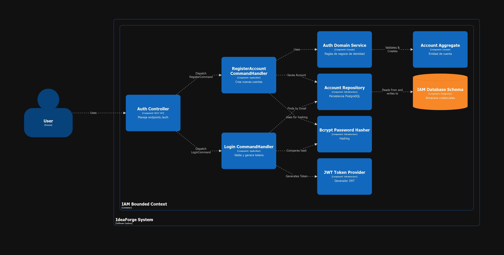

<h4 id="26x6-bounded-context-software-architecture-code-level-diagrams">2.6.1.6 Bounded Context Software Architecture Code Level Diagrams</h4>

<h5 id="26x61-bounded-context-domain-layer-class-diagrams">2.6.1.6.1 Bounded Context Domain Layer Class Diagrams</h5>

El siguiente diagrama de clases ilustra la estructura interna de la capa de dominio para IAM, definiendo el Aggregate Root `Account`, los Value Objects y los puertos (interfaces) que rigen el comportamiento del sistema.

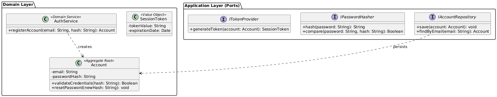

<h5 id="26x62-bounded-context-database-design-diagram">2.6.1.6.2 Bounded Context Database Design Diagram</h5>

Para mantener la cohesión y el bajo acoplamiento, la persistencia de IAM está aislada. El siguiente diagrama representa el esquema de base de datos enfocado exclusivamente en las credenciales y autenticación de usuarios.

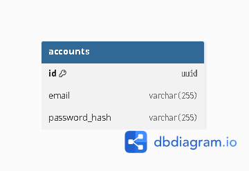

<h3 id="26x-bounded-context-bounded-context-iam">2.6.2 Bounded Context: Profile</h3>

<h4 id="26x1-domain-layer">2.6.2.1 Domain Layer</h4>

<table border="1">
    <thead>
        <tr>
            <th>Clase</th>
            <th>Tipo</th>
            <th>Propósito / Atributos y Métodos</th>
        </tr>
    </thead>
    <tbody>
        <tr>
            <td><strong>User</strong></td>
            <td>Aggregate Root</td>
            <td>Perfil público del usuario. Atributos: <code>fullName</code>, <code>bio</code>, <code>skills[]</code>, <code>interests[]</code>. Método: <code>updateExperience()</code>.</td>
        </tr>
        <tr>
            <td><strong>Skill</strong></td>
            <td>Value Object</td>
            <td>Representa una competencia técnica. Atributos: <code>name</code>, <code>proficiencyLevel</code>.</td>
        </tr>
        <tr>
            <td><strong>ProfileRepository</strong></td>
            <td>Interface</td>
            <td>Abstracción para la persistencia de perfiles en la base de datos (PostgreSQL/MySQL).</td>
        </tr>
    </tbody>
</table>

<h4 id="26x2-interface-layer">2.6.2.2 Interface Layer</h4>

- ProfileController: Endpoints para /profiles/{id} (GET/PUT). Permite a los usuarios actualizar sus habilidades, intereses y su biografia.

<h4 id="26x3-application-layer">2.6.2.3 Application Layer</h4>

**Commands & Handlers:**
* `UpdateProfileCommand`: DTO con los datos actualizados (`bio`, `skills`, etc.).
* `UpdateProfileCommandHandler`: Recupera el `User`, aplica los cambios y guarda el estado actualizado.

**Outbound Ports:**
* `IProfileRepository`: Interfaz para persistencia (ej. `findById()`, `save()`).

<h4 id="26x4-infrastructure-layer">2.6.2.4 Infrastructure Layer</h4>

* **Persistence:** `ProfilePostgresRepository` implementa `IProfileRepository`, mapeando la entidad `User` y sus `Skills` a PostgreSQL.

<h4 id="26x5-bounded-context-software-architecture-component-level-diagrams">2.6.2.5 Bounded Context Software Architecture Component Level Diagrams</h4>

El siguiente diagrama de componentes expone la estructura del contexto de Perfiles, mostrando cómo se orquesta la lectura y actualización de las biografías y habilidades de los usuarios a través de la capa de aplicación.

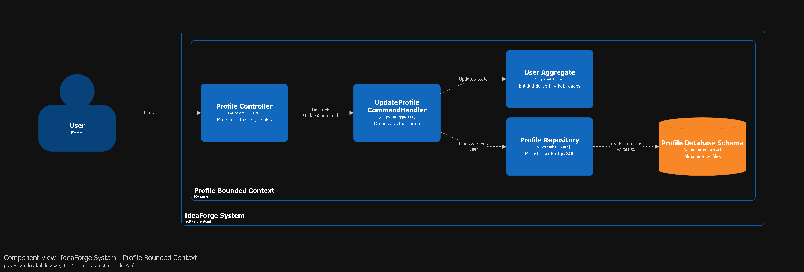

<h4 id="26x6-bounded-context-software-architecture-code-level-diagrams">2.6.2.6 Bounded Context Software Architecture Code Level Diagrams</h4>

<h5 id="26x61-bounded-context-domain-layer-class-diagrams">2.6.2.6.1 Bounded Context Domain Layer Class Diagrams</h5>

En este diagrama de clases se detallan las entidades que conforman el perfil del usuario, incluyendo el Aggregate Root `User` y sus respectivas habilidades (`Skills`).

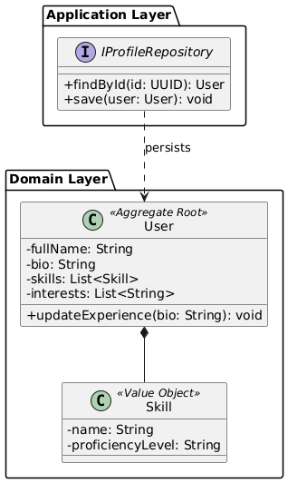

<h5 id="26x62-bounded-context-database-design-diagram">2.6.2.6.2 Bounded Context Database Design Diagram</h5>

El esquema de base de datos para el Bounded Context de Perfiles se muestra a continuación, estructurado para persistir de manera eficiente la información pública y técnica de los colaboradores.

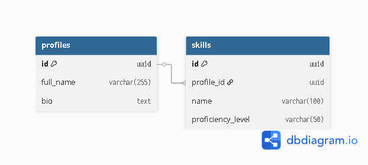

<h3 id="26x-bounded-context-bounded-context-iam">2.6.3 Bounded Context: Ideas Management</h3>

<h4 id="26x1-domain-layer">2.6.3.1 Domain Layer</h4>

<table border="1">
    <thead>
        <tr>
            <th>Clase</th>
            <th>Tipo</th>
            <th>Propósito / Atributos y Métodos</th>
        </tr>
    </thead>
    <tbody>
        <tr>
            <td><strong>Idea</strong></td>
            <td>Aggregate Root</td>
            <td>La propuesta inicial. Atributos: <code>title</code>, <code>description</code>, <code>status</code> (Draft, Published). Método: <code>publishIdea()</code>.</td>
        </tr>
        <tr>
            <td><strong>RequiredRole</strong></td>
            <td>Value Object</td>
            <td>Define qué perfiles busca el creador. Atributos: <code>roleName</code>, <code>quantity</code>.</td>
        </tr>
    </tbody>
</table>

<h4 id="26x2-interface-layer">2.6.3.2 Interface Layer</h4>

- IdeaController: Endpoints /ideas (POST) y /ideas/{id} (GET). Incluye validaciones de Swagger para asegurar que el cuerpo del JSON sea correcto antes de llegar al dominio.

<h4 id="26x3-application-layer">2.6.3.3 Application Layer</h4>

**Commands & Handlers:**
* `PublishIdeaCommand`: DTO con la información de la idea y roles requeridos.
* `PublishIdeaCommandHandler`: Ejecuta la lógica de negocio, construye el Aggregate `Idea` y delega su guardado.

**Outbound Ports:**
* `IIdeaRepository`: Contrato para la gestión de datos en la base de datos.

<h4 id="26x4-infrastructure-layer">2.6.3.4 Infrastructure Layer</h4>

* **Persistence:** `IdeaPostgresRepository` implementa `IIdeaRepository`, almacenando las ideas y sus roles asociados.

<h4 id="26x5-bounded-context-software-architecture-component-level-diagrams">2.6.3.5 Bounded Context Software Architecture Component Level Diagrams</h4>

Este diagrama de componentes ilustra el flujo de gestión de ideas, desde que un emprendedor envía una propuesta a través de la API hasta que esta es procesada y almacenada en el repositorio de la infraestructura.

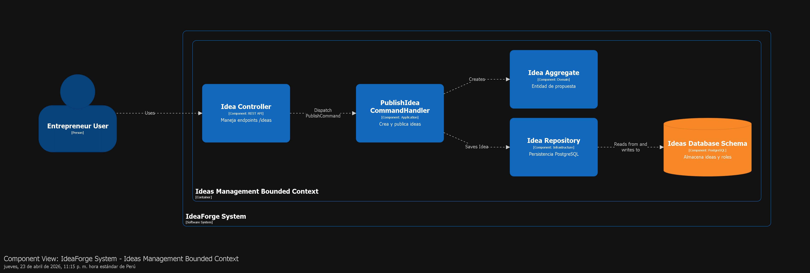

<h4 id="26x6-bounded-context-software-architecture-code-level-diagrams">2.6.3.6 Bounded Context Software Architecture Code Level Diagrams</h4>

<h5 id="26x61-bounded-context-domain-layer-class-diagrams">2.6.3.6.1 Bounded Context Domain Layer Class Diagrams</h5>

El diseño de clases de dominio para la Gestión de Ideas refleja cómo se encapsulan las reglas de negocio alrededor de la publicación de proyectos y la definición de roles requeridos.

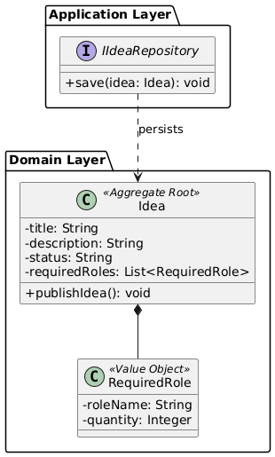

<h5 id="26x62-bounded-context-database-design-diagram">2.6.3.6.2 Bounded Context Database Design Diagram</h5>

El siguiente modelo entidad-relación define las tablas responsables de almacenar las propuestas de proyectos y los perfiles que estas demandan.

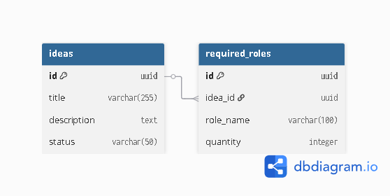

<h3 id="26x-bounded-context-bounded-context-iam">2.6.4 Bounded Context: Exploration</h3>

<h4 id="26x1-domain-layer">2.6.4.1 Domain Layer</h4>

<table border="1">
    <thead>
        <tr>
            <th>Clase</th>
            <th>Tipo</th>
            <th>Propósito / Atributos y Métodos</th>
        </tr>
    </thead>
    <tbody>
        <tr>
            <td><strong>IdeaView</strong></td>
            <td>Read Model</td>
            <td>Representación optimizada de una idea para visualización rápida. Atributos: <code>id</code>, <code>summary</code>, <code>tags</code>.</td>
        </tr>
        <tr>
            <td><strong>FilterCriteria</strong></td>
            <td>Value Object</td>
            <td>Encapsula los parámetros de búsqueda del usuario. Atributos: <code>keyword</code>, <code>category</code>.</td>
        </tr>
    </tbody>
</table>

<h4 id="26x2-interface-layer">2.6.4.2 Interface Layer</h4>

- ExplorationController: Endpoint /exploration/search (GET). Utiliza Query Params para filtrar los resultados que se muestran en el frontend.

<h4 id="26x3-application-layer">2.6.4.3 Application Layer</h4>

**Queries & Handlers:**
* `SearchIdeasQuery`: Transporta los criterios de filtrado (`FilterCriteria`).
* `SearchIdeasQueryHandler`: Ejecuta la búsqueda apoyándose en modelos de lectura optimizados para alto rendimiento (CQRS Query side).

**Outbound Ports:**
* `IExplorationRepository`: Interfaz de lectura enfocada en búsquedas.

<h4 id="26x4-infrastructure-layer">2.6.4.4 Infrastructure Layer</h4>

* **Persistence:** `ExplorationReadRepository` ejecuta consultas SQL directas o vistas materializadas en PostgreSQL para retornar colecciones de `IdeaView` sin hidratar objetos de dominio pesados.

<h4 id="26x5-bounded-context-software-architecture-component-level-diagrams">2.6.4.5 Bounded Context Software Architecture Component Level Diagrams</h4>

El diagrama de componentes del contexto de Exploración muestra la arquitectura optimizada para la lectura rápida (Query side), encargada de filtrar y devolver el catálogo de ideas a los estudiantes.

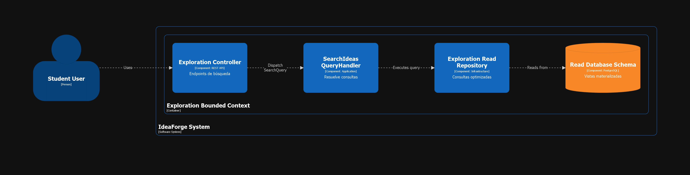

<h4 id="26x6-bounded-context-software-architecture-code-level-diagrams">2.6.4.6 Bounded Context Software Architecture Code Level Diagrams</h4>

<h5 id="26x61-bounded-context-domain-layer-class-diagrams">2.6.4.6.1 Bounded Context Domain Layer Class Diagrams</h5>

A diferencia de otros contextos, el modelo de clases de Exploración se basa fuertemente en modelos de lectura (Read Models) y criterios de filtrado, como se observa en el siguiente diagrama.

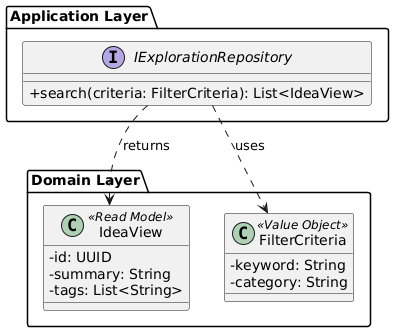

<h5 id="26x62-bounded-context-database-design-diagram">2.6.4.6.2 Bounded Context Database Design Diagram</h5>

Para maximizar el rendimiento en las búsquedas, este esquema de base de datos utiliza vistas desnormalizadas. El diseño se ilustra en el siguiente diagrama.

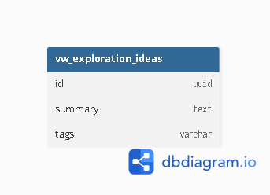

<h3 id="26x-bounded-context-bounded-context-iam">2.6.5 Bounded Context: Collaboration</h3>

<h4 id="26x1-domain-layer">2.6.5.1 Domain Layer</h4>

<table border="1">
    <thead>
        <tr>
            <th>Clase</th>
            <th>Tipo</th>
            <th>Propósito / Atributos y Métodos</th>
        </tr>
    </thead>
    <tbody>
        <tr>
            <td><strong>Postulación</strong></td>
            <td>Entity</td>
            <td>Registro del interés de un colaborador. Atributos: <code>postulanteId</code>, <code>status</code> (Pendiente, Aceptada). Método: <code>accept()</code>, <code>reject()</code>.</td>
        </tr>
        <tr>
            <td><strong>Equipo</strong></td>
            <td>Aggregate Root</td>
            <td>Conjunto de usuarios colaborando. Atributos: <code>projectId</code>, <code>members[]</code>. Método: <code>addMember()</code>.</td>
        </tr>
        <tr>
            <td><strong>MatchingService</strong></td>
            <td>Domain Service</td>
            <td>Lógica para calcular la afinidad entre el perfil del usuario y los roles requeridos.</td>
        </tr>
    </tbody>
</table>

<h4 id="26x2-interface-layer">2.6.5.2 Interface Layer</h4>

- CollaborationController: Endpoints /collaborations (POST) para que el usuario se postule y /collaborations/{id}/approve (POST) para que acepte nuevos miembros.

<h4 id="26x3-application-layer">2.6.5.3 Application Layer</h4>

**Commands & Handlers:**
* `ApplyCommand`: DTO para registrar una postulación.
* `ApproveCommand`: DTO para aprobar a un candidato.
* `ApproveCommandHandler`: Recupera la `Postulación`, llama a su método `accept()`, y delega al Aggregate `Equipo` la acción de `addMember()`.

**Outbound Ports:**
* `IPostulacionRepository` e `IEquipoRepository` para persistir los cambios de estado.

<h4 id="26x4-infrastructure-layer">2.6.5.4 Infrastructure Layer</h4>

* **Persistence:** `PostulacionPostgresRepository` y `EquipoPostgresRepository` manejan las transacciones atómicas requeridas al aprobar un candidato y unirlo a un equipo.

<h4 id="26x5-bounded-context-software-architecture-component-level-diagrams">2.6.5.5 Bounded Context Software Architecture Component Level Diagrams</h4>

El diagrama de componentes a continuación detalla el sistema de Colaboración, evidenciando los flujos de postulación de usuarios y la consolidación de equipos de trabajo aprobados.

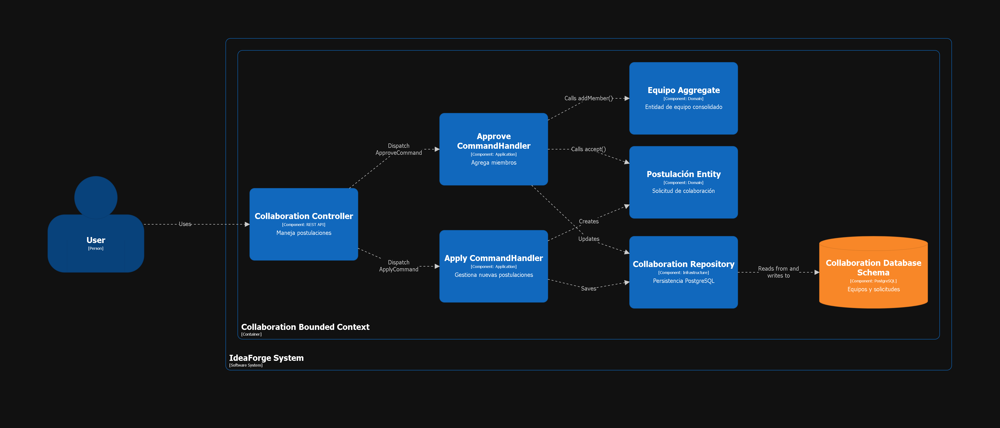

<h4 id="26x6-bounded-context-software-architecture-code-level-diagrams">2.6.5.6 Bounded Context Software Architecture Code Level Diagrams</h4>

<h5 id="26x61-bounded-context-domain-layer-class-diagrams">2.6.5.6.1 Bounded Context Domain Layer Class Diagrams</h5>

Este diagrama de clases de dominio modela las interacciones críticas de negocio para armar equipos, gestionando entidades como `Postulación` y el Aggregate Root `Equipo`.

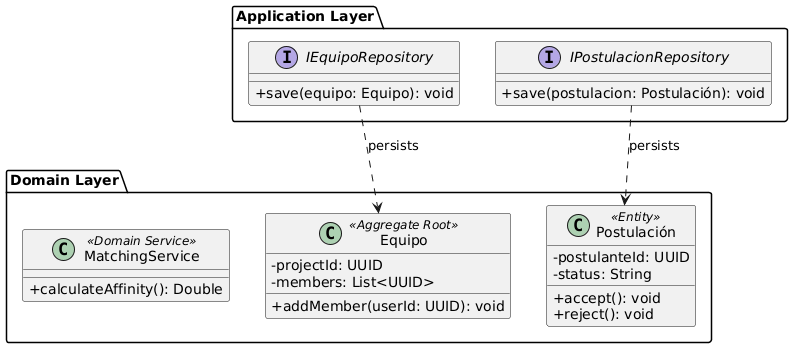

<h5 id="26x62-bounded-context-database-design-diagram">2.6.5.6.2 Bounded Context Database Design Diagram</h5>

Finalmente, el diseño de la base de datos de Colaboración almacena las relaciones entre los equipos conformados y las solicitudes de los postulantes, manteniendo su independencia del resto del sistema.

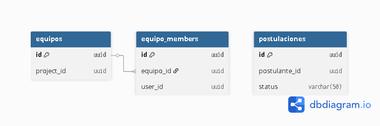
